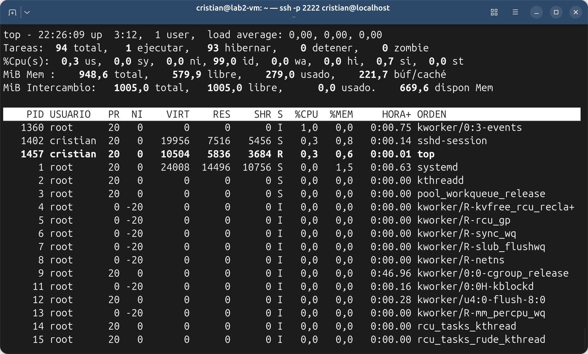
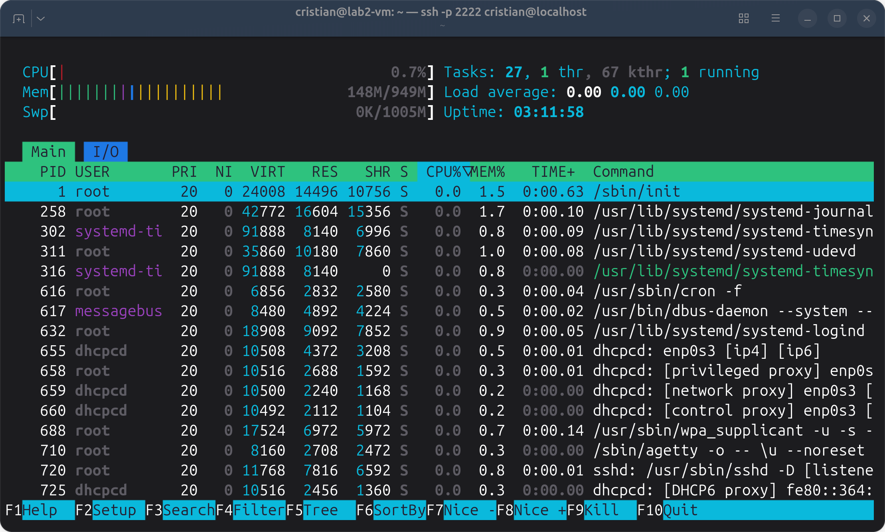

<a id="inicio"></a>

# Administración de servidores GNU/Linux

## Clase 10: Procesos y servicios

Módulo 1 — Operación de Sistemas Operativos GNU/Linux

---

<a id="index"></a>

### Temas de la clase 10

- [Procesos](#procesos)
- [Consumo en tiempo real](#consumo_en_tiempo_real)
- [Terminar un proceso](#terminar_un_proceso)
- [Primer y segundo plano](#primer_y_segundo_plano)
- [Servicios con systemd](#servicios_con_systemd)
- [Cuando un servicio falla](#cuando_un_servicio_falla)
- [Apagado y reinicio](#apagado_y_reinicio)
- [Revisión mínima de un servidor](#revision_minima_de_un_servidor)
- [Actividad práctica — Laboratorio 9](#labs_clase)

[Exportar a PDF](../clase10.html?print-pdf)

---

<a id="objetivos_de_la_clase"></a>

### Objetivos de la clase

Al finalizar vas a poder:

- Identificar qué procesos corren y con qué usuario.
- Encontrar y terminar un proceso que consume recursos.
- Controlar trabajos en primer y segundo plano.
- Iniciar, detener, habilitar y consultar un servicio.
- Apagar y reiniciar el servidor de forma ordenada.

---

<a id="retomamos_la_clase_4"></a>

### Retomamos la clase 4

```bash
systemctl status ssh
systemctl is-enabled ssh
```

- systemd es el **PID 1**, el primer proceso del sistema.
- Inicia el resto y organiza el arranque con *targets*.
- Hasta ahora solo lo consultamos. Hoy vamos a administrar servicios.

> **Nota docente:** recordar también `timedatectl` del Lab 3. El servicio de la práctica es el que mantiene en hora ese reloj.

---

<a id="procesos"></a>

## Procesos

Qué corre en el servidor y con qué usuario.

---

<a id="programa_y_proceso"></a>

### Programa y proceso

Un programa es un archivo, por ejemplo `/usr/bin/sleep`. Un proceso es una ejecución de ese programa.

| Dato | Para qué sirve |
| --- | --- |
| PID | Identificar el proceso; se usa con `kill` |
| Usuario | Saber con qué identidad corre |
| Comando | Saber qué programa es |

El usuario del proceso decide a qué archivos puede acceder, como vimos en la clase 9.

> **Nota docente:** cada comando que escribimos crea un proceso con la identidad de la shell. El «Permiso denegado» que recibía Bruno en la clase 9 era el de su proceso `cat`.

---

<a id="jerarquia_de_procesos"></a>

### Jerarquía de procesos

Cada proceso tiene un padre (PPID). En la raíz está systemd, PID 1.

```bash
pstree -p        # árbol completo con PID
pstree -sp $$    # camino desde PID 1 hasta mi shell
```

`$$` es el PID de la shell actual.

Debian no trae `pstree`. Hay que instalar el paquete **psmisc**:

```bash
sudo apt install psmisc
```

```text
systemd(1)───sshd(714)───sshd-session(890)───sshd-session(897)───bash(898)───pstree(…)
```

La conexión SSH aparece dos veces porque una parte corre como root y otra con tu usuario.

> **Nota docente:** el camino se armó con los PID reales de la VM. En el laboratorio, `psmisc` se instala junto con `htop`. Sin `-s`, `pstree -p $$` muestra solo lo que cuelga de la shell. Sirve para ver de qué servicio viene una sesión o qué procesos lanzó un servicio.

---

<a id="ps_una_foto_del_momento"></a>

### ps: una foto del momento

```bash
ps -ef                  # todos los procesos
ps -ef | grep python    # los que tienen «python» en su línea
ps -u cristian          # procesos de un usuario
```

```text
UID          PID    PPID  C STIME TTY          TIME CMD
root           1       0  0 22:39 ?        00:00:00 /sbin/init
root         714       1  0 22:39 ?        00:00:00 sshd: /usr/sbin/sshd -D …
cristian     810     788  0 22:39 ?        00:00:00 sshd-session: cristian@pts/0
cristian     812     810  0 22:39 pts/0    00:00:00 -bash
```

Las columnas que más usamos son UID (usuario), PID y CMD (comando).

> **Nota docente:** salida real de la VM, recortada. El guion de `-bash` indica una shell de inicio de sesión. `ps -ef | grep x` muestra también la línea del propio `grep` y cualquier proceso que tenga `x` en su línea de comando, así que hay que leer bien antes de terminar algo. `ps aux` es la otra forma habitual: agrega %CPU, %MEM y estado, y por eso se lee peor en pantalla. El consumo lo miramos con `top` y `htop`.

---

<a id="consumo_en_tiempo_real"></a>

## Consumo en tiempo real

`ps` saca una foto; `top` muestra una película.

---

<a id="top"></a>

### top



`top` muestra arriba el estado general del equipo y debajo los procesos, ordenados por consumo de CPU. Se actualiza cada pocos segundos y se sale con `q`.

> **Nota docente:** captura real de la VM, donde `top` sale en español. La cabecera, las columnas y la prioridad se recorren en las diapositivas siguientes.

---

<a id="top_la_cabecera"></a>

### top: la cabecera


| Dato | Qué leer |
| --- | --- |
| `up 3:12` | Tiempo encendido |
| `1 user` | Usuarios conectados |
| `load average` | Carga de 1, 5 y 15 minutos; se compara con la cantidad de CPU (`nproc`) |
| `Tareas` | Procesos por estado, incluidos los zombis |
| `%Cpu(s)` | `us` programas, `sy` kernel, `id` ocioso, `wa` espera de disco |
| `MiB Mem` | RAM total, libre, usada y en búfer/caché |
| `dispon Mem` | Memoria disponible: la que dice si falta memoria |

Con una CPU, una carga de 1 es ocupación plena. Si la carga es alta, la CPU está ociosa y `wa` es alto, el problema está en el disco.

> **Nota docente:** «hibernar» traduce *sleeping*, el estado de un proceso que espera. `ni` es CPU de procesos con prioridad baja; `hi` y `si`, atención de interrupciones; `st`, tiempo que el hipervisor le quita a la VM. Linux usa la memoria libre como búfer y caché y la libera cuando hace falta, así que un «libre» bajo no alcanza para decir que falta memoria. `up` sirve para saber si el servidor se reinició.

---

<a id="top_las_columnas"></a>

### top: las columnas


| Columna | Qué indica |
| --- | --- |
| PID | Número del proceso |
| USUARIO | Con qué usuario corre |
| PR, NI | Prioridad del proceso |
| VIRT | Memoria que el proceso tiene reservada |
| RES | Memoria RAM que usa de verdad |
| SHR | Parte de RES compartida con otros procesos |
| S | Estado |
| %CPU | Porcentaje de CPU que usó en el último intervalo |
| %MEM | RES como porcentaje de la RAM total |
| HORA+ | Tiempo de CPU acumulado, no la hora del día |
| ORDEN | Comando |

Para ver quién consume memoria se mira RES o %MEM. VIRT suele ser mucho más grande y no indica un problema.

> **Nota docente:** HORA+ confunde por la traducción: es el tiempo de CPU que usó el proceso.

---

<a id="top_la_prioridad"></a>

### top: la prioridad

La prioridad se ve en NI y va de **-20 a 19**:

| NI | Prioridad |
| --- | --- |
| -20 | La más alta: cuando varios compiten, recibe más CPU |
| 0 | La normal; casi todos los procesos tienen 0 |
| 19 | La más baja: cuando varios compiten, recibe menos CPU |

> **Nota docente:** PR es 20 + NI, así que un proceso normal muestra `PR 20` y `NI 0`. Los `kworker` de la captura muestran `PR 0` y `NI -20`: son hilos del kernel con la prioridad más alta. Algunos procesos del kernel muestran `rt` en PR, porque son de tiempo real. Cómo cambiar la prioridad (`nice`, `renice`) no entra en la clase.

---

<a id="top_estados_y_teclas"></a>

### top: estados y teclas

La columna S muestra el estado:

| Estado | Lectura |
| --- | --- |
| R, S | Normal: ejecutando o esperando |
| Z | Zombi: ya terminó; mirar el proceso padre |
| D | Esperando disco: muchos, con carga alta, indican un problema de disco |

| Tecla | Acción |
| --- | --- |
| `P` | Ordenar por CPU |
| `M` | Ordenar por memoria |
| `u` | Mostrar un usuario |
| `1` | Una línea por CPU |
| `q` | Salir |

Un proceso que ocupa una CPU entera muestra cerca de 100 % en %CPU.

> **Nota docente:** las líneas `kworker` en estado `I` son hilos del kernel y no hay que hacer nada con ellas. La tabla completa de estados está en el apunte, por si preguntan.

---

<a id="htop"></a>

### htop



- Muestra lo mismo que `top`, con barras, colores y desplazamiento.
- `F3` busca, `F4` filtra, `F5` muestra el árbol, `F6` ordena, y `q` o `F10` salen.
- No viene instalado. Lo instalamos en el laboratorio con `sudo apt install htop`.

Otra alternativa es [`btop`](https://github.com/aristocratos/btop), que se instala con `sudo apt install btop`.

> **Nota docente:** captura real de la VM. Es el único anticipo de la clase 11: alcanza con decir que `apt` instala programas desde los repositorios de Debian. `psmisc` trae `pstree` y `killall`, que tampoco vienen instalados. En USER se ve `systemd-ti`, el nombre recortado de `systemd-timesync`, que es la cuenta del servicio de la práctica. Las líneas de otro color del mismo programa son hilos, y `H` los oculta. `F9` en `htop` y `k` en `top` también terminan procesos, pero en clase usamos `kill`.

---

<a id="terminar_un_proceso"></a>

## Terminar un proceso

Primero se le pide que termine; forzarlo es el último recurso.

---

<a id="como_obtengo_el_pid"></a>

### ¿Cómo obtengo el PID?

Antes de terminar un proceso hay que saber su PID.

```bash
pgrep -a python          # PID y comando de los procesos «python»
ps -ef | grep python     # lo mismo, con usuario y más columnas
jobs -l                  # trabajos lanzados desde esta shell
```

En `top` y `htop` está en la columna PID. En `htop`, `F3` busca por nombre.

```text
$ pgrep -a sleep
951 sleep 200
952 sleep 201
$ kill 951
$ pgrep -a sleep
952 sleep 201
```

> **Nota docente:** salida real de la VM. `pgrep -a` es lo más limpio porque no se muestra a sí mismo. `ps -ef | grep` también trae otros procesos que tienen la palabra en su línea de comando, así que hay que mirar usuario y comando antes de terminar nada. El PID de un servicio aparece en `systemctl status` (Main PID), pero el servicio se detiene con `systemctl stop`.

---

<a id="kill_y_killall"></a>

### kill y killall

```bash
kill 1234         # pedir al proceso 1234 que termine
kill -9 1234      # forzarlo: último recurso
killall sleep     # terminar todos los procesos llamados sleep
```

- `kill` usa el PID que sacamos de `ps`, `top` o `htop`.
- Con `-9`, el programa no puede cerrar ordenadamente.
- `killall` actúa por nombre, así que conviene revisar antes con `pgrep -a sleep`.
- `killall` viene en el paquete **psmisc**, igual que `pstree`, y hay que instalarlo.

Después hay que comprobar que terminó: `ps -p 1234`.

> **Nota docente:** alcance básico. `kill` envía una señal, y la que usa por omisión pide terminar. No desarrollar tipos de señales, `kill -l` ni `pkill`. Sin `psmisc`, la VM responde `-bash: killall: orden no encontrada`.

---

<a id="quien_puede_terminar_que"></a>

### ¿Quién puede terminar qué?

| Proceso | Sin sudo | Con sudo |
| --- | --- | --- |
| Propio | Sí | Sí |
| De otro usuario o de root | No: «Operación no permitida» | Sí |

Un servicio se detiene con `systemctl stop`.

Para terminar un proceso: identificarlo, usar `kill`, comprobar, y usar `kill -9` solo si sigue vivo.

> **Nota docente:** se conecta con la identidad de las clases 8 y 9. Para mostrarlo: `sudo -b sleep 300`, un `kill` sin `sudo` que es rechazado y `sudo kill` para terminarlo. El mensaje real es `kill: (1109) - Operación no permitida`. Si se termina con `kill` el proceso de `systemd-timesyncd`, systemd lo vuelve a iniciar con otro PID porque la unidad tiene `Restart=always` (comprobado en la VM). Un `sudo killall` con un nombre genérico puede cortar procesos de otros usuarios.

---

<a id="primer_y_segundo_plano"></a>

## Primer y segundo plano

Cómo recuperar la terminal sin cortar lo que está corriendo.

---

<a id="trabajos_de_la_shell"></a>

### Trabajos de la shell

```bash
sleep 300 &     # segundo plano: [1] 1234
jobs            # trabajos de esta shell
fg %1           # traer al primer plano
```

| Acción | Efecto |
| --- | --- |
| `comando &` | Arranca en segundo plano |
| `Ctrl+C` | Interrumpe el de primer plano |
| `Ctrl+Z` | **Suspende** el de primer plano, sin terminarlo |
| `bg %1` | Hace que el trabajo suspendido siga corriendo en segundo plano |
| `fg %1` | Lo trae al primer plano |

`[1]` es el número de trabajo; `1234`, el PID.

> **Nota docente:** es el caso de «se me colgó el editor» después de un `Ctrl+Z`: el editor sigue ahí, detenido, y se recupera con `fg`. Con `bg` el trabajo sigue corriendo y la terminal queda libre, como si se hubiera lanzado con `&`. Los trabajos pertenecen a esa shell; otra terminal, o una sesión nueva, no los ve con `jobs`, pero sí con `ps` o `pgrep`.

---

<a id="consultas"></a>

### Consultas

- ¿Qué diferencia hay entre `Ctrl+Z` y `Ctrl+C`?
- ¿Por qué conviene probar `kill` antes que `kill -9`?

---

<a id="servicios_con_systemd"></a>

## Servicios con systemd

Procesos que systemd arranca, vigila y detiene.

---

<a id="dos_preguntas_distintas"></a>

### Dos preguntas distintas

Un servicio es una unidad `.service`, así que `ssh` equivale a `ssh.service`.

| Pregunta | Consulta | Se cambia con |
| --- | --- | --- |
| ¿Corre **ahora**? | `systemctl is-active X` | `start`, `stop`, `restart` |
| ¿Arranca **con el sistema**? | `systemctl is-enabled X` | `enable`, `disable` |

Las dos respuestas son independientes. Un servicio detenido con `stop` vuelve a arrancar al reiniciar si está habilitado, y `enable` no lo inicia en el momento.

> **Nota docente:** es lo que más cuesta que quede claro. Las respuestas habituales son active, inactive y failed, y enabled y disabled. Los temporizadores (`.timer`) se ven en la clase 16. Al proceso de un servicio se lo llama demonio, de ahí la `d` de `sshd`.

---

<a id="administrar_un_servicio"></a>

### Administrar un servicio

```bash
systemctl status X            # consultar: sin sudo
sudo systemctl start X
sudo systemctl stop X
sudo systemctl restart X
sudo systemctl reload X       # si el servicio lo admite
sudo systemctl enable X
sudo systemctl disable X
sudo systemctl enable --now X # habilitar e iniciar
```

Para consultar no hace falta `sudo`; para cambiar, sí.

> **Nota docente:** `restart` corta lo que el servicio estaba haciendo. `reload` hace que relea su configuración sin detenerse, pero no todos los servicios lo admiten. Se retoma con sshd y Apache.

---

<a id="leer_systemctl_status"></a>

### Leer systemctl status

```text
● systemd-timesyncd.service - Network Time Synchronization
     Loaded: loaded (/usr/lib/systemd/system/systemd-timesyncd.service; enabled; preset: enabled)
     Active: active (running) since Sun 2026-09-27 22:39:23 -03; 9min ago
   Main PID: 304 (systemd-timesyn)
     Status: "Contacted time server 170.210.222.2:123 (2.debian.pool.ntp.org)."
     CGroup: /system.slice/systemd-timesyncd.service
             └─304 /usr/lib/systemd/systemd-timesyncd
```

| Línea | Qué leer |
| --- | --- |
| Loaded | Dónde está la unidad y si está habilitada |
| Active | Si corre ahora y desde cuándo |
| Main PID | Proceso principal |
| CGroup | Procesos del servicio |

Al final aparecen las últimas líneas de su registro. Si se abre el paginador, se sale con `q`.

> **Nota docente:** salida real de la VM, sin las líneas `Invocation`, `Docs`, `Tasks`, `Memory` y `CPU`. Sin `sudo`, `status` avisa al pie que no pudo abrir algunos archivos del registro.

---

<a id="que_corre_y_con_que_usuario"></a>

### Qué corre y con qué usuario

```bash
systemctl list-units --type=service --state=running
systemctl --failed
systemctl cat systemd-timesyncd
```

De `systemctl cat` nos interesan dos líneas. `ExecStart=` es el programa que ejecuta y `User=` es la cuenta con la que corre. Si `User=` no figura, en general corre como root.

> **Nota docente:** en la VM se lee `ExecStart=!!/usr/lib/systemd/systemd-timesyncd` y `User=systemd-timesync`. Los `!!` son un prefijo de systemd y se puede decir que no hace falta prestarles atención. `systemctl show -p User X` da el mismo dato en una línea. Editar unidades queda fuera del alcance.

---

<a id="consultas_2"></a>

### Consultas

- Un servicio figura `inactive` y `enabled`. ¿Qué pasará al reiniciar?
- ¿Por qué `systemctl status` no necesita `sudo` y `systemctl stop` sí?

---

<a id="cuando_un_servicio_falla"></a>

## Cuando un servicio falla

El mensaje de error ya indica qué comandos usar.

---

<a id="diagnostico_inicial"></a>

### Diagnóstico inicial

```text
Job for demo-falla.service failed because the control process exited with error
code.
See "systemctl status demo-falla.service" and "journalctl -xeu demo-falla.service"
for details.
```

1. `systemctl status X`: ver si dice `failed` y leer las últimas líneas.
2. `sudo journalctl -xeu X`: el registro del servicio, desde el final.
3. Corregir la causa.
4. `sudo systemctl restart X` y volver a consultar.

```bash
sudo journalctl -u X -n 20    # últimas 20 líneas
sudo journalctl -u X -f       # seguir en vivo; salir con Ctrl+C
```

En la clase 14 vamos a profundizar en los registros.

> **Nota docente:** mensaje real de la VM. `-x` agrega explicaciones cuando las hay y `-e` salta al final. La falla se reproduce sin crear archivos con `sudo systemd-run -p Type=oneshot --unit=demo-falla /usr/bin/false` y se limpia con `sudo systemctl reset-failed demo-falla`. Sin `sudo`, `journalctl -u` responde `-- No entries --`, porque `cristian` no está en `adm` ni en `systemd-journal`.

---

<a id="apagado_y_reinicio"></a>

## Apagado y reinicio

Cómo apagar el servidor sin dañar lo que está corriendo.

---

<a id="apagado_ordenado"></a>

### Apagado ordenado

```bash
sudo systemctl poweroff
sudo systemctl reboot
sudo shutdown -r +5 "Reinicio por mantenimiento"
sudo shutdown -c
```

- `poweroff`, `reboot` y `shutdown` hacen lo mismo que las órdenes de `systemctl`.
- `shutdown` con un tiempo **avisa** a los usuarios conectados, y `-c` lo cancela.
- En un apagado ordenado se detienen los servicios y se desmontan los sistemas de archivos antes de apagar.

---

<a id="apagar_la_vm_no_es_lo_mismo"></a>

### Apagar la VM no es lo mismo

| En VirtualBox | Qué ocurre |
| --- | --- |
| Enviar señal de apagado | El sistema hace un apagado ordenado |
| Apagar la máquina | Equivale a cortar la alimentación |

Por SSH, `poweroff` deja el servidor sin acceso hasta que alguien lo encienda. Antes de apagar o reiniciar, confirmá el equipo con `hostname`.

---

<a id="revision_minima_de_un_servidor"></a>

### Revisión mínima de un servidor

```bash
systemctl list-units --type=service --state=running
systemctl --failed
top
sudo ss -tlnp
```

- ¿Reconozco cada servicio que corre?
- ¿Hay algo roto?
- ¿Algo consume de más en `top`? ¿Con qué usuario corre cada servicio?
- ¿Qué proceso escucha en cada puerto?

Es mejor que un servicio corra con su propia cuenta y no como root. Si un servicio no se usa, se detiene y deshabilita con `sudo systemctl disable --now X`.

> **Nota docente:** aplica dos de las cinco preguntas de endurecimiento. `ss` es un anticipo de la clase 17: en la VM muestra `users:(("sshd",pid=714,…))` en el puerto 22, y sin `sudo` no aparece el proceso. Un servicio que solo se detiene vuelve a arrancar con el próximo inicio. Esta diapositiva cumple la función del resumen.

---

<a id="labs_clase"></a>

### Actividad práctica — Laboratorio 9

**Objetivo:** encontrar y terminar un proceso que consume CPU, y administrar un servicio real.

- Ubicar la propia sesión en el árbol de procesos.
- Controlar trabajos en primer y segundo plano.
- Instalar `htop` y `psmisc`, detectar un consumo de CPU y terminarlo con `kill`.
- Terminar varios procesos por nombre con `killall`.
- Consultar, detener, iniciar, deshabilitar y habilitar `systemd-timesyncd`.
- Leer su registro y comprobar con qué usuario corre.

[Laboratorio 9 — Procesos y servicios](https://github.com/kity-linuxero/linux410-labs/blob/main/lab9/lab9.md)

> **Nota docente:** se usa solo la cuenta administradora y no hace falta el Lab 8. No se reinicia la VM. Al terminar, `systemd-timesyncd` tiene que quedar `active` y `enabled`. Lleva alrededor de una hora. Se probó en la VM ([validación](validacion-laboratorio.md)); el enlace de GitHub va a funcionar cuando se publique la guía.

---

<a id="referencias"></a>

### Referencias

- Ayuda local: `man ps`, `man pstree`, `man top`, `help kill`, `man killall`, `help jobs`.
- [systemctl(1)](https://www.freedesktop.org/software/systemd/man/latest/systemctl.html) y [journalctl(1)](https://www.freedesktop.org/software/systemd/man/latest/journalctl.html).
- [systemd-timesyncd.service(8)](https://www.freedesktop.org/software/systemd/man/latest/systemd-timesyncd.service.html).
- [Debian Wiki — systemd](https://wiki.debian.org/systemd).
