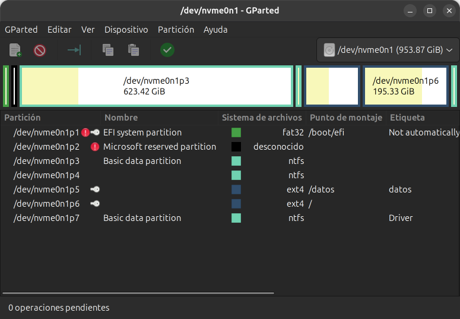

<a id="inicio"></a>

# Administración de servidores GNU/Linux

## Clase 12: Discos, sistemas de archivos y montaje

Módulo 1 — Operación de Sistemas Operativos GNU/Linux

---

<a id="index"></a>

### Temas de la clase 12

- [Discos](#discos)
- [Particiones](#particiones)
- [Sistemas de archivos](#sistemas_de_archivos)
- [Particionado](#particionado)
- [Montaje](#montaje)
- [/etc/fstab](#etc_fstab)
- [Inodos y enlaces](#inodos_y_enlaces)
- [Actividades prácticas y laboratorios](#labs)

[Exportar a PDF](../clase12.html?print-pdf)

---

<a id="objetivos_de_la_clase"></a>

### Objetivos de la clase

Al finalizar vas a poder:

- Explicar qué es un disco, una partición y un sistema de archivos.
- Ampliar una partición y su sistema de archivos.
- Particionar, formatear y montar un disco nuevo.
- Dejarlo montado al arrancar y probar `/etc/fstab` antes de reiniciar.
- Distinguir un enlace duro de uno simbólico.

---

<a id="lo_que_vimos_en_la_clase_3"></a>

### Lo que vimos en la clase 3

- Los discos aparecen en `/dev`: `/dev/sda`, `/dev/sda1`.
- MBR y GPT, la ESP, la swap y ext4.
- Montar es colgar un sistema de archivos en un punto del árbol.

Hoy hacemos el recorrido completo:

```text
disco  →  partición  →  sistema de archivos  →  montaje  →  fstab
```

> **Nota docente:** en la clase 3 prometimos `/etc/fstab` en detalle, y los enlaces se sacaron de la clase 5 para darlos acá.

---

<a id="discos"></a>

## Discos

Dónde se guardan los datos.

---

<a id="a_que_llamamos_disco"></a>

### ¿A qué llamamos disco?

Un dispositivo de almacenamiento que el sistema ve como una serie de **bloques numerados**, donde puede leer y escribir en cualquier posición.

- Linux los llama **dispositivos de bloques**.
- Los trata a todos igual: plato magnético, memoria flash o un archivo.

> **Nota docente:** la idea que conviene dejar: para Linux, un pendrive, un NVMe y el disco de la VM se manejan con las mismas herramientas.

---

<a id="discos_fisicos"></a>

### Discos físicos

| Tipo | Cómo es |
| --- | --- |
| HDD | Platos que giran y un cabezal. Barato por GB, lento para saltar de un lugar a otro. |
| SSD SATA | Memoria flash, sin partes móviles, por la interfaz SATA. |
| NVMe | SSD conectado directo al bus PCIe. Mucho más rápido. |
| Flash | Pendrives, tarjetas SD y eMMC soldada a la placa. |

> **Nota docente:** M.2 es la forma física de la placa; hay discos M.2 SATA y M.2 NVMe. HDD sigue en servidores de almacenamiento y respaldos por el precio por GB. eMMC aparece en Raspberry Pi y notebooks económicas.

---

<a id="discos_virtuales"></a>

### Discos virtuales

Para una VM, el disco es **un archivo del anfitrión**.

| Formato | De dónde viene |
| --- | --- |
| VDI | VirtualBox |
| VMDK | VMware (VirtualBox también lo usa) |
| VHD / VHDX | Hyper-V |
| qcow2 | KVM, QEMU, Proxmox |

- El sistema invitado lo ve como un disco más: `VBOX HARDDISK`.
- Con tamaño dinámico, el archivo crece a medida que se usa.
- Se le puede agregar capacidad.

> **Nota docente:** `Lab2.vdi` tiene 20 GB de capacidad y ocupa 2,9 GB en el anfitrión. En la nube los discos son volúmenes que se conectan a la instancia. La capacidad que se agrega es la base del Laboratorio 11.1.

---

<a id="nombres_en_dev"></a>

### Nombres en /dev

| Disco | Particiones | Qué es |
| --- | --- | --- |
| `sda`, `sdb` | `sda1`, `sda2` | SATA, SAS, USB, discos de VirtualBox |
| `nvme0n1` | `nvme0n1p1` | NVMe |
| `mmcblk0` | `mmcblk0p1` | Tarjeta SD, eMMC |
| `vda` | `vda1` | Disco *virtio* en KVM o Proxmox |
| `sr0` |  | Lectora de CD o DVD |

El orden de las letras **puede cambiar** entre arranques.

> **Nota docente:** si el nombre termina en número, la partición agrega una `p`. En nuestra VM pasó de verdad: con un segundo disco, en un arranque el disco del sistema salió como `sdb`. Lo retomamos al hablar de UUID.

---

<a id="lsblk"></a>

### lsblk

```bash
lsblk
```

```text
NAME   MAJ:MIN RM  SIZE RO TYPE MOUNTPOINTS
sda      8:0    0   20G  0 disk 
├─sda1   8:1    0  967M  0 part /boot/efi
├─sda2   8:2    0 18,1G  0 part /
└─sda3   8:3    0 1005M  0 part [SWAP]
sdb      8:16   0    2G  0 disk 
sr0     11:0    1 1024M  1 rom  
```

- `disk`: el disco entero. `part`: una partición. `rom`: la lectora.
- `sdb` es un disco nuevo: sin particiones y sin montar.

> **Nota docente:** salida real de la VM con el disco de 2 GB del Lab 11.2 agregado. `lsblk` no necesita `sudo`. En Ubuntu se ven además varios `loop`: los snaps de la clase 11.

---

<a id="particiones"></a>

## Particiones

Dividir el disco.

---

<a id="que_es_una_particion"></a>

### ¿Qué es una partición?

Un **tramo del disco** con un comienzo y un fin, anotados en la tabla de particiones.

```text
/dev/sda (20 GB)
┌───────────┬──────────────────────────┬────────────┐
│ sda1      │ sda2                     │ sda3       │
│ ESP 967M  │ /  18,1G                 │ swap 1005M │
└───────────┴──────────────────────────┴────────────┘
```

Una partición sola **no guarda archivos**: es lugar reservado. Necesita un sistema de archivos.

> **Nota docente:** la swap es la excepción: no lleva sistema de archivos, se prepara con `mkswap`. Pedir que miren el orden: la swap está justo después de `/`. Importa para ampliar.

---

<a id="para_que_se_divide_un_disco"></a>

### ¿Para qué se divide un disco?

- La ESP tiene que ser una partición propia para que UEFI arranque.
- Separar sistema y datos: se reinstala sin tocar los datos, y si los datos llenan su lugar, el sistema sigue.
- Cada partición puede tener otro sistema de archivos u otras opciones.
- La swap puede ir en una partición propia.

Dónde empieza y termina cada partición queda anotado en la **tabla de particiones**: MBR o GPT, como vimos en la [clase 3](../clase3.html#/mbr_gpt).

> **Nota docente:** en servidores es común poner los datos en otro disco. LVM (clase 13) da más flexibilidad para repartir el espacio. Si hace falta repasar: las particiones lógicas solo existen en MBR, y nuestra VM es GPT (el Lab 2 llama «partición lógica» a la swap y es un error). GPT guarda una copia de la tabla al final del disco; aparece en el Lab 11.1, cuando `fdisk` avisa que la tiene que mover.

---

<a id="fdisk_l"></a>

### fdisk -l

```bash
sudo fdisk -l /dev/sda
```

```text
Tipo de etiqueta de disco: gpt

Disposit.  Comienzo    Final Sectores Tamaño Tipo
/dev/sda1      2048  1982463  1980416   967M Sistema EFI
/dev/sda2   1982464 39882751 37900288  18,1G Sistema de ficheros de Linux
/dev/sda3  39882752 41940991  2058240  1005M Linux swap
```

- «Etiqueta de disco» es el tipo de tabla.
- Cada partición tiene comienzo, fin y tipo.
- Sin `sudo`: `orden no encontrada`.

> **Nota docente:** salida real, recortada (faltan las líneas del modelo y de los sectores). El tipo es una marca en la tabla; no crea el sistema de archivos. En Debian 13 el `PATH` de un usuario común no incluye `/usr/sbin`: `fdisk`, `blkid`, `mkfs.ext4` y `resize2fs` solo andan con `sudo`.

---

<a id="sistemas_de_archivos"></a>

## Sistemas de archivos

El orden dentro de la partición.

---

<a id="que_es_un_sistema_de_archivos"></a>

### ¿Qué es un sistema de archivos?

La organización que se arma dentro de la partición para guardar archivos con nombre. Lleva la cuenta de:

- qué archivos y carpetas hay;
- dueño, permisos, tamaño y fechas de cada uno;
- en qué bloques están los datos;
- qué bloques están libres.

**Formatear** es crear esa estructura vacía.

> **Nota docente:** comparación para clase: la partición es un depósito vacío; el sistema de archivos son las estanterías numeradas y el cuaderno donde se anota qué hay en cada estante. Formatear empieza un cuaderno nuevo: los datos anteriores quedan inaccesibles.

---

<a id="mkfs"></a>

### mkfs

```bash
sudo mkfs.ext4 /dev/sdb1
```

```text
Creating filesystem with 523776 4k blocks and 131072 inodes
Filesystem UUID: 39d5b8e5-b934-46ef-95d8-e6c778027a96
Creating journal (8192 blocks): done
```

- Bloques de 4 KiB y una cantidad fija de inodos.
- Un UUID para identificarlo.
- Un *journal* para recuperarse después de un corte.

Hay un `mkfs` por tipo: `mkfs.ext4`, `mkfs.xfs`, `mkfs.vfat`...

> **Nota docente:** salida real recortada, en inglés porque `mkfs.ext4` no está traducido. Si detecta un sistema de archivos existente, pregunta; con `-F` no. `-L datos` pone una etiqueta. En la VM solo está el de ext4.

---

<a id="sistemas_de_archivos_en_linux"></a>

### Sistemas de archivos en Linux

| Sistema | Dónde se usa | Qué lo distingue |
| --- | --- | --- |
| ext4 | Debian, Ubuntu | Conocido y simple. Se achica desmontado. |
| XFS | Rocky, RHEL | Archivos grandes. No se puede achicar. |
| Btrfs | openSUSE, Fedora | Instantáneas, subvolúmenes, compresión. |
| ZFS | TrueNAS, Proxmox | Volúmenes e integridad de datos. Fuera del kernel. |
| tmpfs | `/tmp`, `/run` | En RAM: se pierde al reiniciar. |

> **Nota docente:** XFS es el de Rocky (clase 11). ZFS no viene en el kernel por su licencia (CDDL); en Debian está en `contrib` como `zfs-dkms`. Btrfs y ZFS se retoman en la clase 13. En la VM `/tmp` es tmpfs con la mitad de la RAM como tope.

---

<a id="fat32_exfat_y_ntfs"></a>

### FAT32, exFAT y NTFS

| Sistema | Uso típico | Límite |
| --- | --- | --- |
| FAT32 (`vfat`) | ESP, pendrives viejos | Archivos de hasta 4 GB |
| exFAT | Pendrives y tarjetas grandes | Sin límite de 4 GB |
| NTFS | Discos de Windows | Pensado para Windows |

- Linux los lee y escribe.
- No guardan dueños ni permisos de Unix: no sirven para `/`.

> **Nota docente:** el kernel de Debian 13 trae `fat`, `exfat` y `ntfs3`. Para formatearlos hacen falta `dosfstools`, `exfatprogs` o `ntfs-3g`, que la VM no tiene. Para un pendrive entre Windows y Linux, exFAT. Windows no lee ext4 sin programas extra.

---

<a id="lsblk_f_y_blkid"></a>

### lsblk -f y blkid

```bash
lsblk -f
sudo blkid
```

- Muestran el tipo de sistema de archivos y el **UUID**.
- El UUID lo escribe `mkfs` y viaja con el sistema de archivos.
- `sda`, `sdb` pueden cambiar; el UUID no.

Por eso `/etc/fstab` usa UUID.

> **Nota docente:** si se vuelve a formatear, el UUID cambia. `PARTUUID` es de la partición y no cambia al formatear; si preguntan. Justo después de `mkfs`, `lsblk -f` puede tardar unos segundos en mostrarlo; `sudo blkid` lo muestra al instante.

---

<a id="particionado"></a>

## Particionado

Herramientas para crear, borrar y cambiar particiones.

---

<a id="fdisk"></a>

### fdisk

Crea la **tabla de particiones** y **crea, borra y redimensiona** particiones.

| Orden | Qué hace |
| --- | --- |
| `p` | Muestra la tabla |
| `g` / `o` | Tabla GPT / MBR nueva |
| `n` / `d` | Crea / borra una partición |
| `t` | Cambia el tipo |
| `e` | Cambia el tamaño |
| `w` / `q` | Escribe y sale / sale sin escribir |

Nada se escribe en el disco hasta `w`.

> **Nota docente:** `sudo fdisk /dev/sdb`. Antes de abrirlo, mirar `lsblk` y confirmar el disco. Sobre un disco vacío dice que creó una etiqueta DOS (MBR): es el valor por defecto en memoria y `g` la reemplaza. La orden `e` está en el `fdisk` de Debian 13. La sesión completa está en el apunte.

---

<a id="parted_y_gparted"></a>

### parted y GParted

- **`parted`**: lo mismo en una sola línea, útil en scripts. Escribe cada orden en el momento.
- **GParted**: la versión gráfica. Se ven las particiones como una barra y se cambian con el mouse.
- **GParted Live**: una ISO que arranca con GParted listo, para trabajar sobre el disco del sistema sin que esté en uso.

Descarga: [gparted.org/livecd.php](https://gparted.org/livecd.php)

> **Nota docente:** `parted` no está instalado en la VM (`sudo apt install parted`). GParted está en Debian (paquete `gparted`) pero necesita escritorio, y la VM no tiene. Con GParted Live se puede achicar o mover la raíz, cosa que con el sistema montado no se puede. En VirtualBox se carga la ISO en la lectora virtual.

---

<a id="gparted"></a>

### GParted



*Cada partición, con su sistema de archivos y su punto de montaje.*

> **Nota docente:** captura del docente: un disco NVMe con Windows y Linux. Se ven los nombres `nvme0n1p1` a `p7`, la ESP en FAT32, las particiones NTFS de Windows y dos ext4 de Linux. La llave indica que la partición está montada: GParted no deja cambiarla hasta desmontarla, y por eso para la raíz se usa GParted Live.

---

<a id="ampliar_una_particion"></a>

### Ampliar una partición

1. **Agrandar el disco**: el VDI, o el volumen en la nube.
2. **Agrandar la partición**: el espacio libre tiene que estar justo detrás.
3. **Agrandar el sistema de archivos**: `resize2fs` en ext4.

ext4 crece **montado**: se puede ampliar en caliente.

> **Nota docente:** si se hace solo el paso 2, `lsblk` muestra la partición más grande y `df -h` sigue con el tamaño viejo. XFS crece con `xfs_growfs`. Achicar es otra cosa: ext4 solo desmontado, XFS nunca.

---

<a id="ampliar_la_raiz_de_nuestra_vm"></a>

### Ampliar la raíz de nuestra VM

```text
Antes:   [ ESP ][ sda2 /  18,1G ][ sda3 swap ][ 2G libres ]
Después: [ ESP ][ sda2 /  20G              ][ sda3 swap ]
```

```bash
sudo swapoff /dev/sda3
sudo fdisk /dev/sda          # d 3, e 2, n 3, t 3, w
sudo mkswap -U <uuid-anterior> /dev/sda3
sudo swapon -a
sudo resize2fs /dev/sda2
```

La swap está en el medio: se borra y se vuelve a crear al final.

> **Nota docente:** probado en un clon de la VM, con `/` montada y sin reiniciar. `fdisk` avisa que la GPT de respaldo no está al final y la mueve al escribir. `mkswap -U` conserva el UUID que figura en `fstab` y en el *resume* del initramfs; con un UUID nuevo, el arranque tardó 2 minutos y quedó sin swap. También se puede hacer con GParted Live. Es el Laboratorio 11.1.

---

<a id="montaje"></a>

## Montaje

Colgar el sistema de archivos en el árbol.

---

<a id="mount_y_umount"></a>

### mount y umount

Montar es asociar un sistema de archivos a un directorio, el **punto de montaje**. Lo explicamos en la [clase 3](../clase3.html#/punto_montaje).

```bash
sudo mkdir -p /srv/datos
sudo mount /dev/sdb1 /srv/datos
findmnt /srv/datos
sudo umount /srv/datos
```

- El directorio tiene que existir.
- Lo que había adentro queda tapado mientras dura el montaje.
- `umount` lleva una sola `n`.

> **Nota docente:** error frecuente: copiar datos al directorio sin que esté montado y que después «desaparezcan». `findmnt /srv/datos` muestra `/dev/sdb1  ext4  rw,relatime`. `/srv/datos` es provisorio: convive con `/srv/equipo` del Lab 8.

---

<a id="permisos_del_disco_nuevo"></a>

### Permisos del disco nuevo

```bash
ls -ld /srv/datos
```

- La raíz de un ext4 nuevo es de root, modo 755, con `lost+found`.
- Los permisos se cambian **con el disco montado**.
- Si se cambian antes, al montar se ven los de la raíz del disco.

> **Nota docente:** conecta con las clases 8 y 9. `lost+found` es donde `fsck` deja lo que recupera. Antes de montar, `ls -ld` da `drwxr-xr-x 2 root root`; después, `3`, por `lost+found`.

---

<a id="target_is_busy"></a>

### target is busy

```text
umount: /srv/datos: el destino está ocupado.
```

- Algún proceso usa algo ahí. Alcanza con una terminal parada adentro.
- Salir con `cd` y volver a probar.
- `fuser -vm /srv/datos` muestra quién lo usa.

> **Nota docente:** mensaje real. `fuser` es de `psmisc` (Lab 9) y anda sin `sudo`; muestra `cristian  846 ..c.. bash`, donde `c` es directorio actual.

---

<a id="df_y_du"></a>

### df y du

```bash
df -h
du -sh /var/log
sudo du -h --max-depth=1 /var | sort -h
```

- `df`: ¿se está llenando el disco?
- `du`: ¿qué lo está llenando?

> **Nota docente:** ext4 reserva un 5 % para root, por eso `Tamaño` no es `Usados + Disp`. `df -i` muestra los inodos; un disco se puede quedar sin inodos con espacio libre (`No queda espacio en el dispositivo`). Si `df` y `du` no coinciden, suele ser un archivo borrado que un proceso sigue teniendo abierto. Cuotas de disco: una mención.

---

<a id="etc_fstab"></a>

## /etc/fstab

Montar al arrancar.

---

<a id="que_es_etc_fstab"></a>

### ¿Qué es /etc/fstab?

Un archivo de texto con la **lista de sistemas de archivos que se montan al arrancar**. El nombre viene de *file systems table*.

- Una línea por montaje: qué, dónde, de qué tipo y con qué opciones.
- Al arrancar, systemd lo lee y monta cada línea.
- `mount` también lo consulta: `sudo mount /srv/datos` busca el resto de los datos ahí.

Si una línea está mal, el sistema puede no arrancar.

> **Nota docente:** lo que se monta a mano con `mount` se pierde al reiniciar; lo que está en `fstab` queda. systemd convierte cada línea en una unidad `.mount` (clase 10). Se edita con `sudo nano /etc/fstab` (clase 7). `mount /srv/datos` con la línea ya cargada se probó en la VM.

---

<a id="lo_que_dejo_el_instalador"></a>

### Lo que dejó el instalador

```bash
cat /etc/fstab
```

```text
UUID=771f6e7f-...  /          ext4  errors=remount-ro  0  1
UUID=223E-B092     /boot/efi  vfat  umask=0077         0  1
UUID=bc71ad71-...  none       swap  sw                 0  0
/dev/sr0  /media/cdrom0  udf,iso9660  user,noauto  0  0
```

Cada línea es un montaje.

> **Nota docente:** salida real, sin comentarios, con UUID abreviados y columnas alineadas. La última es la lectora de CD (`noauto`: no se monta sola). `errors=remount-ro` pasa `/` a solo lectura si ext4 detecta un error. `umask=0077`: vfat no tiene permisos de Unix y la opción deja la ESP solo para root.

---

<a id="los_seis_campos"></a>

### Los seis campos

```text
UUID=39d5...7a96  /srv/datos  ext4  defaults,nofail  0  2
```

| Campo | Qué indica |
| --- | --- |
| `UUID=...` | Qué montar |
| `/srv/datos` | Dónde |
| `ext4` | Tipo |
| `defaults,nofail` | Opciones, con coma y sin espacios |
| `0` | Respaldo con `dump`: siempre 0 |
| `2` | Orden de `fsck`: 1 para `/`, 2 para el resto |

> **Nota docente:** las columnas se separan con espacios o tabulaciones, en cualquier cantidad. Un espacio dentro de las opciones rompe la línea. `defaults` es `rw,suid,dev,exec,auto,nouser,async`.

---

<a id="nofail"></a>

### nofail

- Si el disco no está, el sistema arranca igual sin él.
- Sin `nofail`, un disco de datos que falta frena el arranque.
- Va en los discos de datos. Nunca en `/`.

> **Nota docente:** medido en la VM: con `nofail` y el disco ausente, el inicio de sesión está disponible enseguida, pero systemd espera 90 segundos. La otra cara: con un UUID mal copiado, el disco no se monta y nadie avisa; lo que se escriba en `/srv/datos` va al disco raíz.

---

<a id="probar_antes_de_reiniciar"></a>

### Probar antes de reiniciar

```bash
sudo umount /srv/datos
sudo systemctl daemon-reload
sudo findmnt --verify
sudo mount -a
findmnt /srv/datos
```

| Comprobación | Detecta |
| --- | --- |
| `findmnt --verify` | UUID inexistente, punto de montaje o tipo equivocado |
| `mount -a` | Además, opciones mal escritas |

> **Nota docente:** probado en la VM: `findmnt --verify` no detecta `noexce`; `mount -a` falla con `ext4: Unknown parameter 'noexce'`. Con la línea correcta da `0 errores, 1 aviso`: el aviso es la lectora de CD y aparece siempre. Hay que desmontar antes, o `mount -a` no prueba la línea nueva. `daemon-reload` porque systemd convierte cada línea en una unidad `srv-datos.mount` (clase 10).

---

<a id="si_fstab_tiene_un_error"></a>

### Si fstab tiene un error

- Sin `nofail`, el arranque espera el disco 90 segundos y entra en **modo de emergencia**.
- En nuestra VM root no tiene contraseña:

```text
You are in emergency mode. ...
No se puede dar acceso a la consola; la cuenta root está bloqueada.
```

- La salida es arrancar desde GRUB. Queda como tarea opcional del laboratorio.

> **Nota docente:** probado en la VM; captura en `validacion/modo-emergencia-root-bloqueado.png`. Enter reintenta el arranque y vuelve a lo mismo. Con root con contraseña, el modo de emergencia da una consola. El procedimiento con `init=/bin/bash` está en el anexo del apunte.

---

<a id="inodos_y_enlaces"></a>

## Inodos y enlaces

Varios nombres para un archivo.

---

<a id="que_es_un_inodo"></a>

### ¿Qué es un inodo?

El sistema de archivos guarda cada archivo en dos partes:

- **el contenido**, en bloques del disco;
- **los datos sobre el archivo**, en un registro numerado: el **inodo**.

El inodo guarda el tipo, el dueño, los permisos, el tamaño, las fechas, cuántos nombres tiene y en qué bloques está el contenido.

**El nombre no está en el inodo.**

> **Nota docente:** inodo viene de *index node*. Con la comparación del sistema de archivos como cuaderno del depósito: cada archivo tiene su hoja numerada, y esa hoja es el inodo. Al formatear el disco de 2 GB se crearon 131072 inodos: si se acaban, no entra ningún archivo más aunque haya espacio (`df -i`).

---

<a id="donde_esta_el_nombre"></a>

### ¿Dónde está el nombre?

En el **directorio**: una lista de nombres, cada uno con su número de inodo.

```text
directorio /srv/datos      inodo 13                 bloques
┌───────────────────┐      ┌───────────────────┐    ┌──────┐
│ lost+found  → 11  │      │ dueño: cristian   │    │ hola │
│ a.txt       → 13  │ ───► │ permisos: rw-rw-r │ ─► └──────┘
└───────────────────┘      │ tamaño: 5 bytes   │
                           │ nombres: 1        │
                           └───────────────────┘
```

- Para abrir `a.txt`, el sistema busca el nombre en el directorio, toma el número y va al inodo.
- Mover un archivo dentro del mismo disco solo cambia el renglón: por eso es instantáneo.

> **Nota docente:** los números son reales (`ls -ia` en `/srv/datos`). Si preguntan: `.` tiene el inodo 2, el de la raíz de ese sistema de archivos, y `..` tiene un número muy distinto porque está en otro disco.

---

<a id="ver_el_inodo"></a>

### Ver el inodo

```bash
ls -i a.txt
stat a.txt
```

```text
  Fichero: a.txt
  Tamaño: 5         	Bloques: 8          Bloque E/S: 4096   regular file
Device: 8,17	Inode: 13          Links: 1
Acceso: (0664/-rw-rw-r--)  Uid: ( 1000/cristian)   Gid: ( 1000/cristian)
Modificación: 2026-10-04 19:39:39.737755254 -0300
```

- `Inode: 13`: el número. `ls -i` muestra solo eso.
- `Links: 1`: cuántos nombres apuntan a este inodo.

> **Nota docente:** salida real, recortada (faltan las fechas de acceso, cambio y creación). `stat` muestra el nombre porque se lo pasamos, no porque esté en el inodo. `Links` es el mismo número que aparece en el segundo campo de `ls -l`, y es la puerta a la diapositiva siguiente.

---

<a id="dos_formas_de_dar_otro_nombre"></a>

### Dos formas de dar otro nombre

- **Enlace duro** (hard link): otro nombre en un directorio que apunta al **mismo inodo**. El archivo tiene dos nombres, y los dos valen lo mismo.
- **Enlace simbólico** (symbolic link): un archivo aparte que guarda **una ruta**. Como un acceso directo.

```text
duro:       a.txt ─┐
                   ├─► inodo 13 ─► datos
            b.txt ─┘

simbólico:  acceso.txt ─► "/srv/datos/a.txt" ─► a.txt ─► inodo 13
```

> **Nota docente:** detenerse acá antes de los comandos. Pregunta para la clase: si borro `a.txt`, ¿qué pasa con `b.txt`? ¿y con `acceso.txt`?

---

<a id="enlace_duro"></a>

### Hard link

```bash
ln a.txt b.txt
ls -li a.txt b.txt
```

```text
13 -rw-rw-r-- 2 cristian cristian 5 oct  4 16:11 a.txt
13 -rw-rw-r-- 2 cristian cristian 5 oct  4 16:11 b.txt
```

- Mismo inodo (13). El contador de nombres está en 2.
- Si se borra `a.txt`, `b.txt` sigue.
- `rm` borra un nombre. Los datos se liberan cuando no queda ninguno.

> **Nota docente:** salida real, en `/srv/datos`. Esto explica la diferencia entre `df` y `du` con un archivo borrado que sigue abierto.

---

<a id="limites_del_enlace_duro"></a>

### Límites del hard link

```text
$ cd /srv/datos
$ ln a.txt ~/c.txt
ln: fallo al crear el enlace duro '/home/cristian/c.txt' => 'a.txt':
Enlace cruzado entre dispositivos no permitido
$ ln dd dd2
ln: dd: no se permiten enlaces fuertes para directorios
```

- No cruza sistemas de archivos: el número de inodo vale dentro de cada uno.
- No se hace sobre directorios.

> **Nota docente:** mensajes reales; el primero sale en una sola línea. Por esto los enlaces van después del montaje: `/srv/datos` y `/home` son sistemas de archivos distintos.

---

<a id="enlace_simbolico"></a>

### Symbolic link

```bash
ln -s /srv/datos/a.txt ~/acceso.txt
ls -l ~/acceso.txt
```

```text
lrwxrwxrwx 1 cristian cristian 16 oct  4 16:11 acceso.txt -> /srv/datos/a.txt
```

- Tiene su propio inodo y guarda una ruta.
- Cruza sistemas de archivos y puede apuntar a directorios.
- Si se borra el destino, queda roto.

> **Nota docente:** salida real. El tamaño (16) es el largo de la ruta. Con ruta relativa, se interpreta desde la carpeta del enlace: parado en `~` con `x.txt`, `ln -s x.txt /srv/datos/rel.txt` queda roto. Los permisos `rwxrwxrwx` del enlace no cuentan.

---

<a id="un_caso_real_usr_merge"></a>

### Un caso real: usr-merge

```bash
ls -l /
```

```text
lrwxrwxrwx   1 root root     7 ago 27 12:05 bin -> usr/bin
lrwxrwxrwx   1 root root     7 ago 27 12:05 lib -> usr/lib
lrwxrwxrwx   1 root root     8 ago 27 12:05 sbin -> usr/sbin
```

Todo está en `/usr`. `/bin` y `/sbin` quedan como enlaces para que `/bin/bash` siga funcionando.

> **Nota docente:** salida real, con otras filas omitidas (`lib64`, `initrd.img` y `vmlinuz` también son enlaces). Otros ejemplos: `/etc/alternatives` y `/etc/systemd/system/*.wants/`, que crea `systemctl enable` (clase 10).

---

<a id="duro_o_simbolico"></a>

### Hard link o symbolic link

|  | Hard | Symbolic |
| --- | --- | --- |
| Qué es | Otro nombre del mismo inodo | Un archivo con una ruta |
| Entre sistemas de archivos | No | Sí |
| A directorios | No | Sí |
| Si se borra el original | El contenido sigue | Queda roto |

---

<a id="consultas"></a>

### Consultas

- ¿Qué le falta a una partición recién creada para guardar archivos?
- ¿Por qué `fstab` usa UUID y no `/dev/sdb1`?
- Después de agrandar una partición, ¿por qué `df` puede seguir mostrando el tamaño viejo?
- ¿Dónde está guardado el nombre de un archivo?
- ¿Por qué un hard link no puede ir de `/srv/datos` a `/home`?

---

<a id="resumen"></a>

### Resumen

```text
disco  →  partición  →  sistema de archivos  →  montaje  →  fstab
```

- Una partición necesita un sistema de archivos para guardar datos.
- Ampliar: disco, partición y sistema de archivos, en ese orden.
- En `fstab`: UUID y `nofail` para los discos de datos.
- Antes de reiniciar: `findmnt --verify` y `mount -a`.
- El inodo guarda todo del archivo menos el nombre.
- Enlace duro: otro nombre del mismo inodo. Simbólico: una ruta.

---

<a id="labs"></a>

## Actividades prácticas y laboratorios

---

<a id="labs_clase"></a>

### Actividad práctica — Laboratorios 11.1 y 11.2

**Objetivo:** ampliar la partición raíz de la VM y agregarle un disco de datos que se monte al arrancar.

- 11.1: sacar la swap y ampliar `/` y su sistema de archivos en caliente.
- 11.2: agregar un disco de 2 GB, particionarlo, formatearlo y montarlo, probar enlaces y dejarlo montado desde `fstab`. Opcional: recuperar un `fstab` roto desde GRUB.

[Laboratorio 11.1 — Ampliar la partición raíz](https://github.com/kity-linuxero/linux410-labs/blob/main/lab11/lab11.1.md)

[Laboratorio 11.2 — Agregar un disco](https://github.com/kity-linuxero/linux410-labs/blob/main/lab11/lab11.2.md)

> **Nota docente:** las dos guías se probaron en la VM del curso el 2026-10-05. Las dos empiezan recomendando una instantánea. Para agregar el disco en el 11.2 la VM tiene que estar apagada (el controlador SATA no admite discos en caliente). El 11.1 no agranda el disco: borra la swap y `sda2` crece sobre ese espacio.

---

<a id="referencias"></a>

### Referencias

- Ayuda local: `man lsblk`, `man fdisk`, `man mkfs.ext4`, `man resize2fs`, `man mount`, `man fstab`, `man findmnt`, `man ln`.
- [GParted Live](https://gparted.org/livecd.php).
- [Debian Reference, capítulo 9: consejos del sistema](https://www.debian.org/doc/manuals/debian-reference/ch09.es.html).
- [Notas de la versión de Debian 13](https://www.debian.org/releases/trixie/release-notes/).
