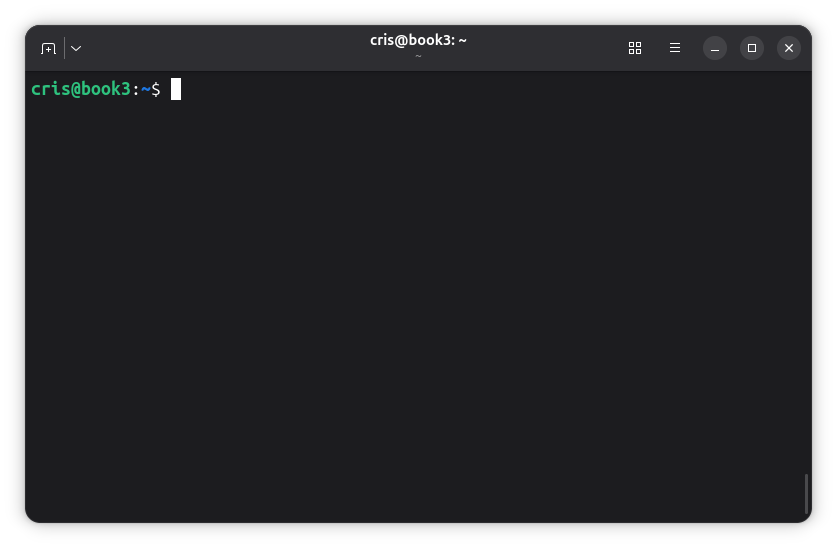

<a id="inicio"></a>

# Administración de servidores GNU/Linux

## Clase 5: Navegación y operaciones con archivos

Módulo 1 — Operación de Sistemas Operativos GNU/Linux

---

<a id="index"></a>

### Temas de clase 5

- [Terminal, shell y comandos](#shell1)
- [Tab, historial y limpieza de pantalla](#linea1)
- [Navegación y rutas](#rutas1)
- [Crear archivos y directorios](#crear1)
- [Copiar, mover y renombrar](#copiar1)
- [Eliminar y diagnosticar errores](#eliminar1)
- [Actividad práctica: operaciones desde SSH](#labs_1)

---

<a id="objetivos"></a>

### Objetivos de la clase

Al finalizar esta clase vas a poder:

- Diferenciar una **terminal**, una **shell** y un comando.
- Reconocer la estructura básica de una orden de Bash.
- Usar Tab y el historial para trabajar con mayor precisión.
- Recorrer el árbol con rutas absolutas y relativas.
- Crear, copiar, mover, renombrar y eliminar archivos y directorios.

> **Por qué vemos este tema:** ya podemos ingresar al servidor por SSH. Antes de administrar servicios y configuraciones necesitamos aprender a ubicarnos y operar con archivos desde la línea de comandos.

---

<a id="shell1"></a>

### La shell:

#### La interfaz de administración

---

<a id="terminal_shell_comando"></a>

### Terminal, shell y comando

- **Terminal:** ventana o dispositivo desde el cual escribimos y vemos resultados.
- **Shell:** programa que interpreta la línea y decide qué ejecutar.
- **Comando:** instrucción que ejecuta un programa externo o una función de la shell.

 

> **Terminal → Bash → comando → resultado**

SSH aporta la conexión; la terminal permite interactuar; Bash interpreta lo que escribimos.

  

---

<a id="shells"></a>

### Bash y otras shells

| Shell | Característica |
| --- | --- |
| `sh` | Shell histórica y referencia para una sintaxis común de scripts. |
| **Bash** | *Bourne Again Shell*. Es la que utilizaremos en el curso. |
| **Zsh** | Orientada al uso interactivo y muy configurable. |
| **Fish** | Interfaz amigable, con algunas diferencias de sintaxis. |
| **Dash** | Pequeña y rápida; Debian suele usarla como `/bin/sh`. |

Los ejemplos del curso estarán escritos para **Bash**.

```bash
echo "$SHELL"      # shell configurada para el usuario
bash --version     # versión instalada
```

---

<a id="sintaxis"></a>

### Cómo se escribe un comando

```text
comando [opciones] [argumentos]
```

```bash
ls -la /var/log
```

- `ls`: comando.
- `-la`: opciones cortas `-l` y `-a`.
- `/var/log`: argumento; en este caso, una ruta.

Las opciones cambian el comportamiento. Los argumentos indican sobre qué objeto trabajar.

---

<a id="opciones_argumentos"></a>

### Opciones, argumentos y orden

```bash
ls -l /etc
ls --format=long /etc

cp origen.txt destino.txt
```

- Las opciones cortas suelen comenzar con `-`; las largas, con `--`.
- No todos los comandos ofrecen las mismas opciones.
- En operaciones con archivos, el orden entre origen y destino importa.

---

<a id="ayuda_man"></a>

### `--help`, `help` y `man`

```bash
ls --help          # resumen rápido
help cd            # orden interna de Bash
man ls             # página de manual
man 5 passwd       # sección 5 del manual
```

- `--help`: confirma rápidamente opciones y sintaxis.
- `help`: documenta órdenes internas de Bash.
- `man`: documentación completa instalada en el sistema.

Dentro de `man`: Espacio avanza, `b` retrocede, `/texto` busca, `n` repite la búsqueda y `q` sale.

---

<a id="man_espanol"></a>

### Manuales en español

```bash
sudo apt update
sudo apt install man-db manpages manpages-es

LANG=es_AR.UTF-8 man ls
```

No todas las páginas están traducidas. Si no existe una versión en español, se utiliza la original.

- [Debian Manpages](https://manpages.debian.org/): referencia preferida para versión, paquete e idioma.
- [man.cx: `man(1)` en español](https://man.cx/man(1)/es): alternativa rápida con distintas fuentes e idiomas.

---

<a id="nombres_espacios"></a>

### Nombres con espacios

```bash
mkdir "Documentos del curso"
ls Documentos\ del\ curso
```

Los espacios separan argumentos. Las comillas o la barra invertida permiten tratarlos como parte del nombre. Su funcionamiento se retomará junto con los comodines.

> Para archivos de administración suele ser más práctico usar nombres como `documentos-curso` o `documentos_curso`.

---

<a id="preguntas_shell"></a>

## Consultas

Terminal → shell → Bash → opciones y argumentos

---

<a id="linea1"></a>

### Trabajar con la línea:

#### Tab, historial y limpieza de pantalla

---

<a id="tab"></a>

### Autocompletado con Tab

```bash
cd /etc/sys<Tab>
```

- Una pulsación completa si existe una única coincidencia.
- Una segunda pulsación muestra las alternativas.
- Completa comandos, archivos, directorios y, cuando están definidas, opciones.
- Reduce errores de tipeo y ayuda a descubrir nombres reales.

> Tab evita errores de escritura; no confirma que la operación sea correcta.

---

<a id="historial"></a>

### Historial de comandos

```bash
history
```

- Flechas arriba y abajo: recorrer órdenes recientes.
- **Ctrl + R:** buscar hacia atrás por una parte del comando.
- Repetir Ctrl + R: buscar una coincidencia anterior.
- Enter: ejecutar. Flecha: editar. Ctrl + C: cancelar.

El historial persistente se guarda habitualmente en `~/.bash_history`.

---

<a id="limpiar_pantalla"></a>

### Limpiar la pantalla

```bash
clear
```

- **Ctrl + L:** limpia la vista desde el teclado.
- Ambas opciones vuelven a colocar el prompt en la parte superior.
- No borran el historial ni detienen los procesos en ejecución.

> Limpiar la pantalla no es lo mismo que limpiar el historial.

---

<a id="limpiar_historial"></a>

### Limpiar el historial de Bash

```bash
history -c      # limpia la lista de esta sesión
history -w      # sobrescribe ~/.bash_history
```

- Cerrar antes las otras sesiones del mismo usuario.
- Limpiar por separado el historial de root, si se utilizó.
- Útil antes de convertir una VM en plantilla.

> No elimina logs ni prepara por sí solo una plantilla segura. Los logs son parte de la auditoría.

---

<a id="preguntas_linea"></a>

## Consultas

Tab → historial → Ctrl + R → clear / Ctrl + L

---

<a id="rutas1"></a>

### Navegación y rutas:

#### Saber dónde estamos y sobre qué actuamos

---

<a id="directorio_actual"></a>

### El directorio de trabajo

La shell siempre está ubicada en algún directorio del árbol.

```text
cristian@lab2-vm:~$
```

```bash
pwd
# /home/cristian
```

1. ¿Con qué usuario estoy trabajando?
2. ¿En qué directorio estoy?
3. ¿Qué ruta recibirá el comando?

---

<a id="listar"></a>

### Listar el contenido

```bash
ls
ls /etc
ls -l /etc
ls -la
ls -lh /var/log
ls -ld /etc
```

- `-l`: listado largo.
- `-a`: incluye nombres ocultos.
- `-h`: tamaños legibles junto con `-l`.
- `-d`: muestra el directorio, no su contenido.

---

<a id="cd"></a>

### Cambiar de directorio

```bash
cd /etc       # ir a /etc
cd ..         # subir al directorio padre
cd ~          # ir al home
cd            # también vuelve al home
cd -          # volver al directorio anterior
```

`cd` es una orden interna: cambia el directorio de la shell actual.

---

<a id="componentes_ruta"></a>

### Componentes especiales

| Componente | Significado |
| --- | --- |
| `/` | Raíz del árbol. |
| `.` | Directorio actual. |
| `..` | Directorio padre. |
| `~` | Home del usuario. |
| `-` | Directorio anterior, usado por `cd`. |

> `/` es la raíz. `/root` es el home del usuario root.

---

<a id="absolutas_relativas"></a>

### Rutas absolutas y relativas

**Absoluta:** comienza en `/` y expresa la ubicación completa.

```text
/home/cristian/documentos/informe.txt
```

**Relativa:** comienza desde el directorio de trabajo actual.

```text
documentos/informe.txt
```

Si estamos en `/home/cristian`, ambas apuntan al mismo objeto.

---

<a id="nombres_linux"></a>

### Nombres: Linux es case-sensitive

El sistema de archivos distingue mayúsculas de minúsculas:

- `informe.txt`, `Informe.txt` e `INFORME.txt` son nombres diferentes.
- También distingue cada componente: `/home/Cristian` y `/home/cristian` no son equivalentes.
- La extensión orienta, pero no determina por sí sola el tipo de archivo.
- Un nombre que comienza con `.` se oculta en listados normales.

---

<a id="preguntas_rutas"></a>

## Consultas

`pwd` → `ls` → `cd` → rutas

---

<a id="crear1"></a>

### Crear archivos y directorios:

#### Construir nuestro árbol de trabajo

---

<a id="mkdir"></a>

### Crear directorios con mkdir

```bash
cd /tmp
mkdir laboratorio-clase5
mkdir laboratorio-clase5/config
mkdir laboratorio-clase5/logs laboratorio-clase5/datos
```

Se pueden crear uno o varios directorios. El directorio padre debe existir.

---

<a id="mkdir_p"></a>

### Crear un árbol con mkdir -p

```bash
mkdir laboratorio-clase5/backup/diario
# Error: falta backup

mkdir -p laboratorio-clase5/backup/diario
mkdir -p laboratorio-clase5/clientes/norte
mkdir -p laboratorio-clase5/clientes/sur
```

- `-p` crea los componentes intermedios que faltan.
- No informa error si el directorio final ya existe.

---

<a id="touch"></a>

### Crear archivos con touch

```bash
cd ~/laboratorio-clase5
touch config/servidor.conf
touch logs/acceso.log logs/error.log
ls -l config logs
```

- Si el archivo no existe, `touch` crea uno vacío.
- Si existe, actualiza sus marcas de tiempo: no lo vacía.
- `touch -c nombre` evita crear un archivo inexistente.

> `touch` no es un editor.

---

<a id="preguntas_crear"></a>

## Consultas

`mkdir` → `mkdir -p` → `touch`

---

<a id="copiar1"></a>

### Copiar, mover y renombrar:

#### Origen y destino

---

<a id="cp"></a>

### Copiar archivos

```bash
cp config/servidor.conf backup/servidor.conf
cp config/servidor.conf backup/
cp logs/acceso.log logs/error.log backup/diario/
```

- El primer argumento es el origen; el último, el destino.
- El destino puede ser un nombre nuevo o un directorio existente.
- Un destino existente puede ser sobrescrito.

---

<a id="cp_directorios"></a>

### Copiar directorios y controlar cambios

```bash
cp -r config backup/config-copia
cp -iv config/servidor.conf backup/
```

- `-r`: copia directorios recursivamente.
- `-i`: pregunta antes de sobrescribir.
- `-n`: no sobrescribe.
- `-v`: muestra cada operación.

> Una copia en el mismo servidor no es, por sí sola, un backup.

---

<a id="mv"></a>

### Mover y renombrar

```bash
mv logs/acceso.log logs/acceso-anterior.log
mv logs/error.log backup/diario/
mv clientes/norte datos/
```

- Renombrar es un caso particular de mover.
- `mv` mueve directorios sin necesitar `-r`.
- `-i`, `-n` y `-v` ayudan a controlar la operación.

---

<a id="mv_sistemas"></a>

### Mover no siempre cuesta lo mismo

- **Dentro del mismo sistema de archivos:** suele cambiar la asociación del nombre.
- **Entre sistemas de archivos:** puede copiar los datos y luego eliminar el origen.

Por eso mover un archivo grande entre discos puede tardar y requiere espacio en el destino.

> Antes y después: listar el origen y el destino.

---

<a id="preguntas_copiar"></a>

## Consultas

Origen → destino → copiar → mover → renombrar

---

<a id="eliminar1"></a>

### Eliminar y diagnosticar:

#### Operaciones sin papelera

---

<a id="rm"></a>

### rmdir y rm

```bash
mkdir directorio-vacio
rmdir directorio-vacio       # solo si está vacío

rm archivo.txt               # elimina un archivo
rm -i archivo.txt            # pregunta
rm -r arbol-de-prueba        # elimina el árbol
```

La terminal no envía estos objetos a una papelera. La recuperación no es sencilla.

---

<a id="rm_seguro"></a>

### Antes de borrar

```bash
whoami
pwd
ls -la arbol-de-prueba
rm -ri arbol-de-prueba
```

1. Confirmar identidad.
2. Confirmar ubicación.
3. Inspeccionar el objetivo.
4. Usar la variante menos amplia.
5. Verificar el resultado.

> `rm -rf` no debería convertirse en una receta automática.

---

<a id="errores1"></a>

### Errores frecuentes

| Mensaje | Qué revisar |
| --- | --- |
| `command not found` | Nombre, instalación o `PATH`. |
| `No such file or directory` | Ruta, ubicación o componente faltante. |
| `Permission denied` | Permisos del objeto y de la ruta. |
| `File exists` | El destino ya existe. |
| `Not a directory` | Un componente de la ruta es un archivo. |
| `Directory not empty` | `rmdir` recibió un directorio con contenido. |

---

<a id="errores2"></a>

### Argumentos y nombres especiales

- `missing operand`: falta un argumento obligatorio.
- `invalid option`: la opción no existe o un nombre comenzó con `-`.

```bash
touch -- -informe
rm -- -informe
```

`--` marca el final de las opciones. Lo que sigue se interpreta como argumento.

---

<a id="diagnostico"></a>

### Método de diagnóstico

1. Leer el mensaje completo.
2. Identificar comando y ruta.
3. Comprobar usuario y directorio actual.
4. Listar origen y destino.
5. Consultar `comando --help`.
6. Corregir la causa sin agregar `sudo` por reflejo.

> El comando puede terminar bien y aun así actuar sobre un destino equivocado.

---

<a id="preguntas_eliminar"></a>

## Consultas

Eliminar → verificar → leer errores → corregir la causa

---

<a id="resumen"></a>

### Resumen de la clase

- La terminal permite interactuar y Bash interpreta las órdenes.
- `--help`, `help` y `man` permiten consultar documentación.
- Tab completa nombres; Ctrl + R busca en el historial.
- `history -c` y `history -w` limpian el historial de Bash.
- `pwd`, `ls` y `cd` permiten ubicarnos y recorrer el árbol.
- Una ruta absoluta parte de `/`; una relativa depende del directorio actual.
- Linux es *case-sensitive*: distingue mayúsculas de minúsculas.
- `mkdir` y `touch` crean la estructura de trabajo.
- `cp` copia, `mv` mueve y `rm` elimina.
- Los errores se leen antes de repetir la orden o agregar `sudo`.

---

<a id="labs"></a>

## Actividades prácticas y laboratorios

---

<a id="labs_1"></a>

## Actividad práctica

*Organización de archivos desde una sesión SSH*

1. Consultar comandos con `--help`, `help` y `man`.
2. Crear un árbol dentro de `~/laboratorio-clase5`.
3. Navegar con rutas absolutas, relativas, `..`, `~` y `cd -`.
4. Comprobar que los nombres distinguen mayúsculas y minúsculas.
5. Crear, copiar, mover y renombrar archivos.
6. Provocar y diagnosticar errores comunes.
7. Eliminar solamente el árbol del ejercicio.
8. Revisar la limpieza del historial al finalizar.

[Laboratorio 4 — Navegación y operaciones con archivos](https://github.com/kity-linuxero/linux410-labs/blob/main/lab4/lab4.md)

---

<a id="referencias"></a>

### Referencias

- [GNU Bash Reference Manual](https://www.gnu.org/software/bash/manual/bash.html)
- [GNU Bash — History Builtins](https://www.gnu.org/software/bash/manual/html_node/Bash-History-Builtins.html)
- [GNU Bash — Commands for Completion](https://www.gnu.org/software/bash/manual/html_node/Commands-For-Completion.html)
- [Debian — paquete `man-db`](https://packages.debian.org/trixie/man-db)
- [Debian — paquete `manpages-es`](https://packages.debian.org/trixie/manpages-es)
- [Debian Manpages](https://manpages.debian.org/)
- [man.cx — `man(1)` en español](https://man.cx/man(1)/es)
- [GNU Coreutils Manual](https://www.gnu.org/software/coreutils/manual/coreutils.html)
