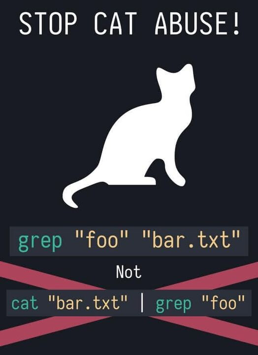

<a id="inicio"></a>

# Administración de servidores GNU/Linux

## Clase 6: Lectura, comparación y búsqueda de archivos

Módulo 1 — Operación de Sistemas Operativos GNU/Linux

---

<a id="index"></a>

### Temas de clase 6

- [Comodines y comillas](#comodines1)
- [Identificación y lectura de archivos](#lectura1)
- [Principio, final y conteos](#partes1)
- [Comparación con `diff`](#diff1)
- [Búsqueda por nombre con `find`](#find1)
- [Búsqueda por contenido y tuberías](#grep1)
- [Actividad práctica](#labs_clase)

---

<a id="objetivos"></a>

### Objetivos de la clase

Al finalizar esta clase vas a poder:

- Seleccionar nombres con comodines y controlar su interpretación con comillas.
- Elegir cómo consultar un archivo según su tipo y tamaño.
- Observar una parte del contenido y obtener conteos básicos.
- Comparar archivos y leer una diferencia unificada.
- Buscar archivos por nombre y líneas por contenido.
- Conectar dos comandos mediante una tubería.

> **Por qué vemos este tema:** para administrar un servidor necesitamos localizar configuraciones, consultar logs y comparar versiones sin modificar los archivos.

---

<a id="elegir_herramienta"></a>

### Elegir según la tarea

| Necesidad | Herramienta |
| --- | --- |
| Identificar un archivo | `file` |
| Mostrar o recorrer contenido | `cat` / `less` |
| Ver el comienzo o el final | `head` / `tail` |
| Contar contenido | `wc` |
| Comparar dos versiones | `diff` |
| Buscar un nombre | `find` |
| Buscar texto | `grep` |

Primero definimos qué necesitamos. Después elegimos el comando.

---

<a id="comodines1"></a>

### Comodines y comillas

#### Seleccionar nombres antes de ejecutar

---

<a id="expansion_nombres"></a>

### Un patrón no es un nombre literal

Supongamos que el directorio contiene:

```text
acceso-01.log
acceso-02.log
acceso-final.log
error-01.log
inventario.txt
```

```bash
ls acceso-*.log
```

Bash expande el patrón antes de ejecutar `ls`.

> `ls` recibe los nombres encontrados, no el asterisco.

---

<a id="comodines_basicos"></a>

### Los comodines básicos

| Patrón | Coincide con | Ejemplo |
| --- | --- | --- |
| `*` | Cero o más caracteres | `*.log` |
| `?` | Exactamente un carácter | `acceso-0?.log` |
| `[abc]` | Un carácter de la lista | `informe-[abc].txt` |
| `[0-9]` | Un carácter del rango | `acceso-0[1-9].log` |

```bash
ls *.log
ls acceso-??.log
ls acceso-0[12].log
ls archivo*[0-3]
```

Los comodines se pueden combinar. `archivo*[0-3]` comienza con `archivo` y termina con un dígito del 0 al 3.

---

<a id="alcance_comodines"></a>

### Alcance y nombres ocultos

- Los comodines trabajan sobre nombres, no sobre el contenido.
- `logs/*.log` busca dentro de `logs`, pero no recorre sus subdirectorios.
- `*` no incluye normalmente nombres que comienzan con punto.

```bash
ls *
ls .*
ls -a
```

Para observar archivos ocultos suele ser más claro utilizar `ls -a`.

---

<a id="sin_coincidencias"></a>

### Cuando no hay coincidencias

```bash
ls *.respaldo
```

```text
ls: cannot access '*.respaldo': No such file or directory
```

En la configuración habitual de Bash, el patrón sin coincidencias queda sin expandir.

Antes de operar sobre varios nombres, conviene revisar la selección:

```bash
ls -- logs/*.log
```

---

<a id="comillas"></a>

### Comillas y barra invertida

```bash
ls '*.log'
ls "*.log"
ls \*.log
```

En los tres casos, Bash protege el asterisco y no lo expande.

- **Comillas simples:** conservan literalmente todo su contenido.
- **Comillas dobles:** conservan espacios y comodines, pero permiten expansiones como `$VARIABLE`.
- **Barra invertida:** protege solamente el carácter siguiente.

```bash
ls "Documentos del curso"
ls Documentos\ del\ curso
```

---

<a id="preguntas_comodines"></a>

## Consultas

Patrón → expansión de Bash → coincidencias → previsualización

---

<a id="lectura1"></a>

### Identificar y leer archivos

#### Consultar sin modificar

---

<a id="file"></a>

### No todo archivo contiene texto legible

```bash
file /etc/os-release
file /bin/ls
file /usr/share/man/man1/ls.1.gz
```

```text
/etc/os-release: symbolic link to ../usr/lib/os-release
/bin/ls: ELF 64-bit LSB pie executable ...
/usr/share/man/man1/ls.1.gz: gzip compressed data ...
```

`file` inspecciona el contenido y otros indicios. No decide solamente por la extensión.

> Primero identificamos el archivo. Después elegimos cómo consultarlo.

---

<a id="cat"></a>

### `cat`: mostrar contenido archivos

```bash
cat /etc/os-release
cat /etc/hostname /etc/hosts
cat -n /etc/os-release
```

- Su nombre proviene de *concatenate*.
- Con varios archivos, muestra sus contenidos en orden.
- `-n` agrega números a las líneas.

Resulta adecuado cuando el contenido entra en la pantalla. Para archivos extensos conviene `less`.

> `cat` muestra la salida. No modifica el archivo.

---

<a id="less"></a>

### `less`: recorrer sin editar

```bash
less /etc/services
```

| `↓` o `j` | Avanzar una línea |
| --- | --- |
| `↑` o `k` | Retroceder una línea |
| `Espacio` | Avanzar una pantalla |
| `b` | Retroceder una pantalla |

| `g` / `G` | Comienzo / final |
| --- | --- |
| `/texto` | Buscar |
| `n` | Repetir la búsqueda |
| `q` | Salir |

`less` permite recorrer y buscar dentro de configuraciones o logs extensos sin abrirlos en un editor.

---

<a id="more"></a>

### `less` y `more`

```bash
more /etc/services
```

`more` también muestra texto por pantallas.

- Ofrece una implementación más sencilla.
- Tiene menos posibilidades de navegación.
- Puede aparecer en otros sistemas o procedimientos.

> En el curso utilizaremos `less` como visor principal.

---

<a id="gzip"></a>

### Archivos `.gz`

```bash
cp /etc/services servicios.txt
gzip -k servicios.txt

zcat servicios.txt.gz
zless servicios.txt.gz
```

- `gzip -k` crea `servicios.txt.gz` y conserva el original.
- `zcat` envía el contenido descomprimido a la terminal.
- `zless` abre ese contenido en el visor paginado.

`gzip` comprime archivos individuales. El empaquetado de directorios con `tar` se verá más adelante.

---

<a id="preguntas_lectura"></a>

## Consultas

Identificar → archivo breve o extenso → texto normal o comprimido

---

<a id="partes1"></a>

### Principio, final y conteos

#### Consultar solo lo necesario

---

<a id="head"></a>

### El comienzo con `head`

```bash
head /etc/passwd
head -n 5 /etc/passwd
head -n 3 /etc/hosts /etc/services
```

- Sin opciones, muestra las primeras diez líneas.
- `-n` permite elegir otra cantidad.
- Con varios archivos, agrega un encabezado para cada bloque.

Es útil para comprobar rápidamente el formato y las primeras entradas.

---

<a id="tail"></a>

### El final con `tail`

```bash
tail /var/log/dpkg.log
tail -n 20 /var/log/dpkg.log
tail -f /var/log/dpkg.log
```

- Sin opciones, muestra las últimas diez líneas.
- `-n` permite elegir otra cantidad.
- `-f` espera y muestra las nuevas líneas que recibe el archivo.

> **Ctrl + C** interrumpe el seguimiento y devuelve el prompt.

---

<a id="wc"></a>

### Contar con `wc`

`wc` viene de *word count*, “conteo de palabras”. Sin opciones informa líneas, palabras y bytes.

```bash
wc /etc/passwd
wc -l /etc/passwd
wc -w /etc/services
wc -c /etc/hosts
```

| Opción | Cuenta |
| --- | --- |
| `-l` | Líneas |
| `-w` | Palabras |
| `-c` | Bytes |
| `-m` | Caracteres |

---

<a id="bytes_caracteres"></a>

### Bytes y caracteres

Un carácter Unicode puede ocupar más de un byte. Por eso `wc -c` y `wc -m` no siempre coinciden.

```bash
wc -c /etc/hosts
wc -m /etc/hosts
wc -l /etc/hosts /etc/passwd
```

Con varios archivos, `wc` informa cada conteo y agrega un total.

> Contar líneas no explica qué significa cada entrada.

---

<a id="preguntas_partes"></a>

## Consultas

Comienzo → final → seguimiento → conteo

---

<a id="diff1"></a>

### Comparar archivos

#### Ver qué cambió entre dos versiones

---

<a id="diff_basico"></a>

### `diff`: ver qué cambió

```bash
diff archivo-anterior.conf archivo-actual.conf
```

- `diff` compara el contenido de ambos archivos.
- Si son iguales, no muestra diferencias.
- Una salida vacía puede ser un resultado válido.

> El orden importa: primero la versión anterior y después la actual.

---

<a id="diff_unificado"></a>

### Diferencia unificada

```bash
diff -u archivo-anterior.conf archivo-actual.conf
diff --color -u archivo-anterior.conf archivo-actual.conf
```

```diff
--- archivo-anterior.conf
+++ archivo-actual.conf
@@ -1,2 +1,2 @@
 puerto=22
-acceso_root=si
+acceso_root=no
```

`-u` agrega contexto. En GNU `diff`, `--color` resalta la salida cuando se muestra en una terminal.

---

<a id="leer_diff"></a>

### Cómo leer la salida

- `---` identifica el primer archivo.
- `+++` identifica el segundo.
- Una línea con `-` está en el primero y no en el segundo.
- Una línea con `+` está en el segundo y no en el primero.
- Las líneas sin esos signos aportan contexto.

El color facilita la lectura, pero los signos conservan el significado.

> `diff` describe la diferencia. La decisión sobre cuál versión es correcta sigue siendo nuestra.

---

<a id="diff_directorios"></a>

### Comparar directorios

```bash
diff directorio-a directorio-b
diff -r directorio-a directorio-b
```

- Sin `-r`, la comparación no desciende por todos los subdirectorios.
- Con `-r`, compara los archivos correspondientes en ambos árboles.

Cambiar el orden invierte los signos `-` y `+`.

> Comparar no modifica ninguno de los dos lados.

---

<a id="preguntas_diff"></a>

## Consultas

Primera versión → segunda versión → diferencias → decisión

---

<a id="find1"></a>

### Buscar por nombre

#### `find` recorre un árbol

---

<a id="find_basico"></a>

### Ruta inicial y tipo

```text
find ruta criterios
```

```bash
find ~/documentos
find ~/documentos -type f
find ~/documentos -type d
```

- La ruta inicial define desde dónde comienza el recorrido.
- `-type f` selecciona archivos regulares.
- `-type d` selecciona directorios.

Un punto de inicio demasiado amplio puede tardar y encontrar rutas sin permiso de lectura.

---

<a id="find_name"></a>

### Buscar nombres con patrones

```bash
find ~/documentos -type f -name '*.log'
find ~/documentos -type f -name 'acceso-??.log'
find ~/documentos -type f -iname '*.conf'
```

- `-name` compara el nombre con el patrón.
- Las comillas impiden que Bash expanda el patrón antes de tiempo.
- `-iname` ignora diferencias entre mayúsculas y minúsculas.

> En este caso queremos que `find`, y no Bash, interprete `*.log`.

---

<a id="find_criterios"></a>

### Reducir los resultados

```bash
find /etc -maxdepth 1 -type f -name '*.conf'
find ~/documentos -type f -size +10k
find ~/documentos -type f -mtime -1
```

- `-maxdepth 1` limita la profundidad del recorrido.
- `-size +10k` selecciona archivos mayores que 10 KiB.
- `-mtime -1` selecciona modificaciones de menos de 24 horas.

Los criterios se combinan. Cada resultado debe cumplirlos.

---

<a id="preguntas_find"></a>

## Consultas

Ruta inicial → recorrido → tipo → nombre o propiedad → resultados

---

<a id="grep1"></a>

### Buscar por contenido

#### `grep` y tuberías sencillas

---

<a id="grep_basico"></a>

### `grep` busca líneas

```bash
grep 'root' /etc/passwd
grep -n 'root' /etc/passwd
grep -in 'ssh' /etc/services
grep -w 'root' /etc/passwd
```

| Opción | Función |
| --- | --- |
| `-n` | Muestra el número de línea |
| `-i` | Ignora mayúsculas y minúsculas |
| `-w` | Exige una palabra completa |

---

<a id="find_o_grep"></a>

### Nombre o contenido

```bash
find /etc -maxdepth 1 -type f -iname '*ssh*'
grep -in 'ssh' /etc/services
```

- `find` busca objetos por su nombre o propiedades.
- `grep` busca texto dentro de un archivo.

> Primero definimos qué estamos buscando: un archivo o una línea de texto.

---

<a id="tuberias"></a>

### Tuberías

El carácter `|` conecta la salida del comando de la izquierda con la entrada del comando de la derecha.

```text
comando1 | comando2
```

```bash
grep -in 'tcp' /etc/services | head -n 5
```

`grep` produce las líneas y `head` conserva solamente las cinco primeras.

> La tubería evita crear un archivo intermedio.

---

<a id="tee"></a>

### `tee`: mostrar y guardar

`tee` recibe datos por la entrada estándar y los envía a dos lugares: la terminal y uno o más archivos.

```text
comando | tee archivo
```

```bash
head -n 5 /etc/services | tee muestra.txt
```

- `head` produce las cinco líneas.
- `tee` las muestra y también las guarda en `muestra.txt`.
- Sin opciones, reemplaza el contenido del archivo. Con `-a`, agrega al final.

> Su nombre recuerda a una conexión en T: una entrada continúa por dos salidas.

---

<a id="cat_grep"></a>

### Cuando `cat` no aporta

```bash
cat servicios | grep -w 'ssh'
```

```bash
grep -w 'ssh' servicios
```

Ambas formas funcionan, pero `grep` ya sabe abrir el archivo.

`cat` sigue siendo útil para mostrar archivos breves o concatenar varios archivos.

 

---

<a id="preguntas_grep"></a>

## Consultas

`grep` → coincidencias → tubería → segundo comando

---

<a id="resumen"></a>

### Resumen de la clase

- Bash expande los comodines antes de ejecutar el comando.
- Las comillas y la barra invertida controlan la interpretación de caracteres especiales.
- `file` identifica el contenido; `cat` y `less` permiten consultarlo.
- `gzip -k` conserva el original; `zcat` y `zless` leen la copia comprimida.
- `head`, `tail` y `wc` ayudan a observar y medir.
- `diff -u` muestra diferencias con contexto y `--color` facilita su lectura.
- `find` busca objetos; `grep` busca líneas.
- Una tubería conecta comandos; `tee` permite mostrar y guardar la salida.

---

<a id="labs_clase"></a>

### Actividad práctica

- [Laboratorio 5](https://github.com/kity-linuxero/linux410-labs/blob/main/lab5/lab5.md): lectura, comparación y búsqueda de archivos

---

<a id="referencias1"></a>

### Referencias

- [GNU Bash — Filename Expansion](https://www.gnu.org/software/bash/manual/html_node/Filename-Expansion.html)
- [GNU Bash — Quoting](https://www.gnu.org/software/bash/manual/html_node/Quoting.html)
- [GNU Bash — Pipelines](https://www.gnu.org/software/bash/manual/html_node/Pipelines.html)
- [GNU Coreutils Manual](https://www.gnu.org/software/coreutils/manual/coreutils.html)
- [GNU Diffutils Manual](https://www.gnu.org/software/diffutils/manual/diffutils.html)
- [GNU Findutils Manual](https://www.gnu.org/software/findutils/manual/html_mono/find.html)
- [GNU Grep Manual](https://www.gnu.org/software/grep/manual/grep.html)

---

<a id="referencias2"></a>

### Debian Manpages

- [`file(1)`](https://manpages.debian.org/trixie/file/file.1.en.html)
- [`less(1)`](https://manpages.debian.org/trixie/less/less.1.en.html)
- [`more(1)`](https://manpages.debian.org/trixie/util-linux/more.1.en.html)
- [`gzip(1)`](https://manpages.debian.org/trixie/gzip/gzip.1.en.html)
- [`zcat(1)`](https://manpages.debian.org/trixie/gzip/zcat.1.en.html)
- [`zless(1)`](https://manpages.debian.org/trixie/gzip/zless.1.en.html)
