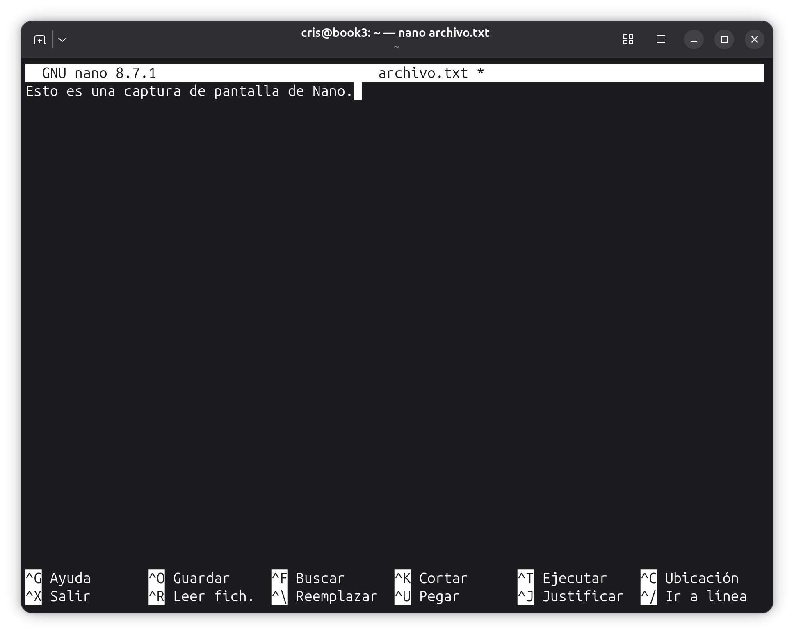
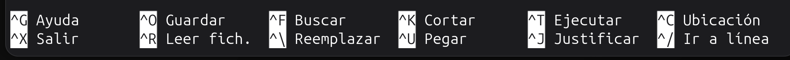
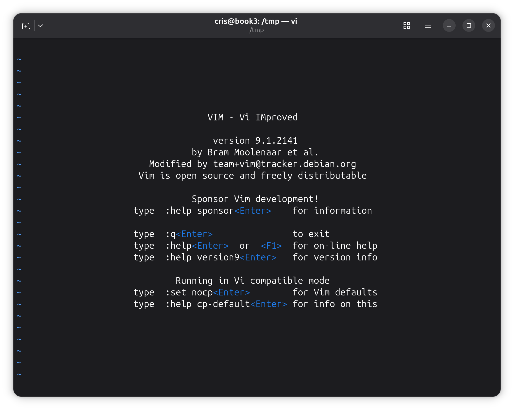
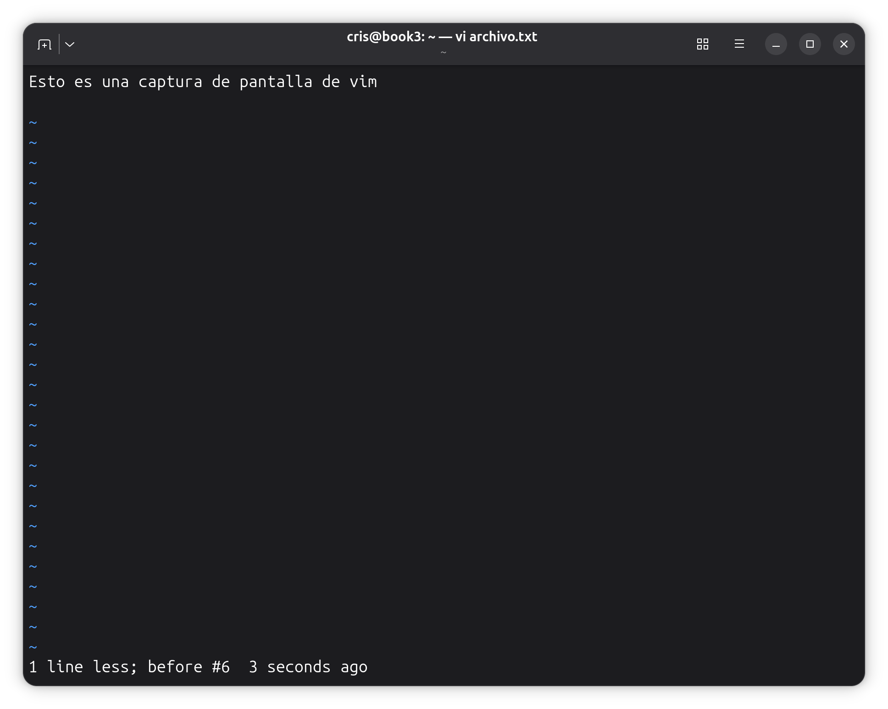
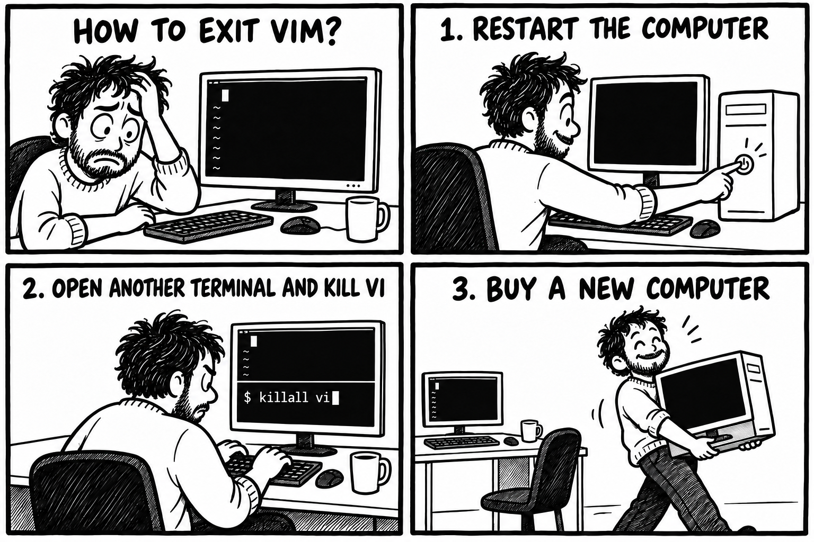

<a id="inicio"></a>

# Administración de servidores GNU/Linux

## Clase 7: Edición de archivos de texto en la terminal

Módulo 1 — Operación de Sistemas Operativos GNU/Linux

---

<a id="index"></a>

### Temas de la clase 7

- [Por qué necesitamos un editor](#editores1)
- [Edición con GNU nano](#nano1)
- [De Vi a Vim](#historia_vi)
- [Modos y edición básica con Vi/Vim](#modos_vi)
- [`more`, redirecciones y una introducción a `sed`](#sin_editor)
- [Actividad práctica](#labs_clase)

---

<a id="objetivos"></a>

### Objetivos de la clase

Al finalizar esta clase vas a poder:

- Abrir, buscar, modificar y guardar un archivo con Nano.
- Reconocer los modos de Vi/Vim y volver al modo normal.
- Desplazarte y realizar cambios básicos con Vi/Vim.
- Guardar el trabajo o salir descartando los cambios.
- Reconocer qué herramientas quedan disponibles en un entorno mínimo.
- Crear y transformar texto sin abrir un editor.

> En la clase anterior aprendimos a leer y buscar. Ahora vamos a modificar archivos sin perder de vista qué cambió.

---

<a id="elegir_herramienta"></a>

### Una herramienta para cada tarea

Esta tabla sirve para ubicar las herramientas que ya vimos y las que aparecen hoy.

| Necesidad | Herramienta |
| --- | --- |
| Recorrer un archivo sin modificarlo | `less` / `more` |
| Editar con atajos visibles | Nano |
| Editar mediante modos y órdenes | Vi/Vim |
| Crear o agregar una línea conocida | `echo` con `>` o `>>` |
| Repetir una sustitución | `sed` |
| Comprobar qué cambió | `diff -u` |

---

<a id="editores1"></a>

## Editores de texto en Linux

Una herramienta básica para administrar el sistema

---

<a id="archivos_linux"></a>

### En Linux, casi todo se presenta como archivos

La configuración del sistema, los servicios, los usuarios y muchas aplicaciones se describen mediante archivos de texto.

También usamos texto para escribir scripts, documentar cambios y preparar datos que después leerá otro programa.

```text
/etc/ssh/sshd_config
/etc/hosts
/etc/fstab
```

> Administrar Linux exige poder leer y editar texto desde la terminal.

---

<a id="sin_entorno_grafico"></a>

### Cuando no hay entorno gráfico

En un servidor solemos trabajar por SSH o desde una consola. En recuperación y en contenedores mínimos podemos tener todavía menos herramientas.

- A veces está Nano.
- Otras veces encontramos Vi o Vim.
- En una imagen mínima puede no estar instalado ninguno.

```bash
command -v nano vi less more
```

Antes de depender de una herramienta, conviene comprobar si realmente existe en ese entorno.

---

<a id="consultar_editar"></a>

### Leer o editar

| Tarea | Opciones |
| --- | --- |
| Mostrar un archivo corto | `cat` |
| Recorrer un archivo largo | `less` o `more` |
| Modificar texto | Nano, Vi, Vim u otro editor |
| Escribir una línea conocida | `echo` y una redirección |

> Primero vemos qué necesitamos hacer. Después elegimos la herramienta disponible.

---

<a id="nano1"></a>

## GNU nano

Atajos y mensajes a la vista

---

<a id="nano_abrir"></a>

### La pantalla de Nano

```bash
nano archivo.txt
```

- Arriba aparecen la versión y el nombre del archivo.
- El asterisco indica que hay cambios sin guardar.
- Abajo quedan visibles los atajos principales.

 

---

<a id="nano_atajos"></a>

### Los atajos están a la vista

   

`^` representa `Ctrl`. Por ejemplo, `^O` significa `Ctrl+O`.

La ayuda cambia según la versión y el estado del editor. Por eso conviene mirar siempre las dos líneas inferiores.

---

<a id="nano_mover_buscar"></a>

### Moverse y buscar

| Atajo | Acción |
| --- | --- |
| Flechas | Mover el cursor |
| `Ctrl+A` / `Ctrl+E` | Comienzo / final de la línea |
| `Ctrl+F` o `Ctrl+W` | Buscar texto |
| `Alt+F` o `Alt+W` | Buscar la coincidencia siguiente |
| `Ctrl+C` | Mostrar la posición del cursor |

Desde Nano 8, `Ctrl+F` inicia la búsqueda hacia adelante. `Ctrl+W` también funciona y aparece en muchas versiones anteriores.

Después del atajo, Nano pide el texto en la barra inferior.

---

<a id="nano_editar"></a>

### Cortar, copiar y pegar

| Atajo | Acción |
| --- | --- |
| `Alt+A` | Iniciar o finalizar una selección |
| `Alt+6` | Copiar la selección o la línea |
| `Ctrl+K` | Cortar la selección o la línea |
| `Ctrl+U` | Pegar |
| `Alt+U` / `Alt+E` | Deshacer / rehacer |

Si la terminal interpreta `Alt` de otra manera, la ayuda visible de Nano permite confirmar el atajo.

---

<a id="nano_guardar"></a>

### Guardar y salir

| Atajo | Acción |
| --- | --- |
| `Ctrl+O` | Guardar. Nano pide el nombre del archivo. |
| `Ctrl+X` | Salir |
| `Ctrl+G` | Abrir la ayuda |
| `Ctrl+C` | Mostrar la posición del cursor |

Si hay cambios pendientes, Nano pregunta si queremos guardarlos.

> Conviene leer la pregunta antes de responder. El editor indica qué acción está por realizar.

---

<a id="preguntas_nano"></a>

## Consultas

abrir → buscar → modificar → guardar → salir

---

<a id="historia_vi"></a>

## De Vi a Vim

Una idea de los años setenta que todavía usamos

---

<a id="vi_visual"></a>

### Vi nació como editor visual

Bill Joy desarrolló Vi en Berkeley durante la década de 1970. El programa surgió a partir de `ex`, un editor que trabajaba principalmente con líneas.

Las nuevas terminales permitían mover el cursor y actualizar distintas partes de la pantalla. De allí viene el nombre **vi**, abreviatura de *visual*.

```vim
:w
:q
```

Las órdenes con `:` todavía conservan la relación con `ex`.

---

<a id="vi_en_vm"></a>

### En nuestra VM, `vi` abre Vim

```bash
vi archivo.txt
```

**Vim** significa *Vi IMproved*. Conserva el modelo y los comandos básicos de Vi, pero agrega funciones más modernas.

Esto puede cambiar en otro sistema. Incluso una imagen mínima como `debian:latest` puede no traer `vi` instalado.

 

---

<a id="modos_vi"></a>

## El modelo de Vi/Vim

La misma tecla puede hacer cosas distintas según el modo

---

<a id="modos"></a>

### Cuatro modos para empezar

| Modo | Para qué sirve | Cómo entrar | Cómo volver a Normal |
| --- | --- | --- | --- |
| Normal | Moverse y ejecutar acciones | Al abrir Vim o con `Esc` | Ya estamos en Normal |
| Inserción | Escribir texto | `i`, `a` u `o` | `Esc` |
| Visual | Seleccionar texto | `v` o `V` | `Esc` |
| Línea de órdenes | Guardar, salir y otras órdenes | `:` | `Enter` ejecuta; `Esc` cancela |

> Vim interpreta las teclas según el modo activo. Si no sabés dónde estás, presioná `Esc` y volvés al modo normal.

---

<a id="reconocer_modo"></a>

### El modo cambia lo que hace el teclado

En **modo normal**, escribir `x` borra un carácter. No escribe la letra «x».

Con `i` entramos en **modo inserción**. Vim suele mostrar `-- INSERT --` en la parte inferior.

Con `Esc` dejamos de escribir y volvemos al modo normal.

 

---

<a id="insertar_vi"></a>

### Entrar en modo inserción

| Comando | Dónde comienza a escribir |
| --- | --- |
| `i` | Antes del cursor |
| `a` | Después del cursor |
| `o` | Nueva línea debajo |

Después de escribir, `Esc` regresa al modo normal.

“Insert mode” es un estado del editor. No es una orden que se escriba después de `:`.

---

<a id="movimiento_vi"></a>

### Desplazamiento en modo normal

| Comando | Movimiento |
| --- | --- |
| Flechas | Mover el cursor en las cuatro direcciones |
| `h j k l` | Izquierda, abajo, arriba y derecha |
| `0` / `$` | Comienzo / final de la línea |
| `gg` / `G` | Primera / última línea |

Las flechas también funcionan. Los movimientos propios de Vi se incorporan de a poco.

---

<a id="operaciones_vi"></a>

### Borrar, copiar y pegar

| Comando | Acción |
| --- | --- |
| `x` | Borrar el carácter bajo el cursor |
| `dd` | Cortar la línea |
| `yy` | Copiar la línea |
| `p` | Pegar después del cursor |
| `u` | Deshacer |

Vi llama *yank* a la copia. Por eso el comando comienza con `y`.

---

<a id="visual_vi"></a>

### Selección visual

1. Desde el modo normal, `v` selecciona caracteres y `V` selecciona líneas completas.
2. Movemos el cursor para ampliar la selección.
3. `y` copia, `d` corta y `Esc` cancela.
4. De vuelta en modo normal, `p` pega.

> El modo visual no es un editor separado: es una forma de seleccionar antes de ejecutar una acción.

---

<a id="buscar_vi"></a>

### Buscar dentro del archivo

| Comando | Acción |
| --- | --- |
| `/texto` | Buscar hacia adelante |
| `n` | Coincidencia siguiente |
| `N` | Coincidencia anterior |

```vim
/puerto
```

Buscar no modifica el contenido. Desde la coincidencia podemos movernos o iniciar una edición.

---

<a id="salir_meme"></a>

### ¿Cómo salir de vi?

  

`Esc` vuelve al modo normal.

`:q` sale cuando no hay cambios pendientes.

`:q!` sale descartando los cambios pendientes.

---

<a id="guardar_salir_vi"></a>

### Guardar y salir

| Orden | Acción |
| --- | --- |
| `:w` | Guardar |
| `:q` | Salir si no hay cambios pendientes |
| `:q!` | Salir y descartar los cambios |
| `:wq` | Guardar y salir |
| `:x` | Guardar si hubo cambios y salir |

Las órdenes con `:` se escriben desde el modo normal y se confirman con `Enter`.

> `!` fuerza una operación del editor. No concede permisos ni reemplaza a `sudo`.

---

<a id="supervivencia_vi"></a>

### Lo mínimo para no quedar atrapado

```text
Esc       volver al modo normal
i         comenzar a escribir
/texto    buscar
:w        guardar
:q        salir
:q!       salir sin guardar
```

> Con esto alcanza para abrir un archivo, hacer un cambio sencillo y salir con control.

---

<a id="preguntas_vi"></a>

## Consultas

modo normal → movimiento u operación → inserción → `Esc` → guardar o descartar

---

<a id="sin_editor"></a>

## No siempre hace falta un editor

Leer, crear o transformar texto con lo que haya disponible

---

<a id="entorno_minimo"></a>

### En un contenedor mínimo

En una imagen como `debian:latest` podemos encontrarnos sin Nano, sin Vi y hasta sin `less`.

```bash
command -v nano vi less more
more /etc/os-release
```

`more` es más sencillo que `less`, pero alcanza para recorrer un archivo pantalla por pantalla. Para un archivo corto también podemos usar `cat`.

Además, la shell y sus redirecciones permiten crear o agregar contenido sin abrir un editor.

---

<a id="redireccion_crear"></a>

### Crear contenido con `>`

```bash
echo 'puerto=8080' > servidor.conf
```

La shell envía la salida de `echo` al archivo.

- Si el archivo no existe, lo crea.
- Si ya existe, reemplaza todo su contenido.

```bash
more servidor.conf
```

---

<a id="redireccion_agregar"></a>

### Agregar contenido con `>>`

```bash
echo 'entorno=pruebas' >> servidor.conf
echo 'registro=activo' >> servidor.conf
```

| Operador | Resultado |
| --- | --- |
| `>` | Crea el archivo o reemplaza el contenido |
| `>>` | Crea el archivo o agrega al final |

> Antes de usar `>`, revisá el nombre del archivo de destino.

---

<a id="sed_basico"></a>

### Una sustitución con `sed`

```bash
sed 's/puerto=8080/puerto=9090/' servidor.conf
```

```text
s / texto anterior / texto nuevo /
```

La orden muestra el resultado transformado en la terminal.

En este ejemplo, el archivo original no cambia.

---

<a id="sed_comparar"></a>

### Transformar y comparar

```bash
sed 's/puerto=8080/puerto=9090/' servidor.conf \
  > servidor.conf.nuevo
```

```bash
diff -u servidor.conf servidor.conf.nuevo
```

Si la comparación muestra exactamente lo esperado, podemos decidir si corresponde reemplazar la versión anterior.

```bash
mv servidor.conf.nuevo servidor.conf
```

---

<a id="sed_peligro"></a>

### Entrada y salida con el mismo nombre

```bash
# Incorrecto: puede vaciar el archivo
sed 's/8080/9090/' servidor.conf > servidor.conf
```

La shell prepara la redirección antes de iniciar `sed`. Por eso puede vaciar el archivo antes de que el programa alcance a leerlo.

```bash
sed 's/8080/9090/' servidor.conf > servidor.conf.nuevo
```

> En esta clase siempre usamos un nombre nuevo y comparamos el resultado.

---

<a id="elegir_editar_transformar"></a>

### Editar o transformar

| Situación | Opción |
| --- | --- |
| Solo necesitamos leer y no está `less` | `cat` o `more` |
| Hay que leer el contexto y hacer varios cambios | Nano o Vi/Vim |
| Conocemos todo el contenido | Redirección con `>` |
| Solo hay que agregar una línea | Redirección con `>>` |
| El reemplazo debe repetirse | `sed` |
| Queremos revisar antes de reemplazar | Archivo nuevo y `diff -u` |

---

<a id="resumen"></a>

### Resumen de la clase

- Muchos aspectos del sistema se administran mediante archivos de texto.
- En una terminal remota o un contenedor mínimo, las herramientas disponibles pueden cambiar.
- Nano muestra los atajos y permite escribir de forma directa.
- Vi/Vim separa el desplazamiento, la edición y las órdenes mediante modos.
- `Esc` vuelve al modo normal. `:w`, `:q` y `:q!` permiten guardar o salir.
- `cat` y `more` permiten consultar archivos sin abrir un editor.
- `>` reemplaza el contenido. `>>` agrega al final.
- `sed` puede producir una versión transformada sin abrir un editor.
- Una copia y `diff -u` permiten revisar el cambio antes de aceptarlo.

---

<a id="labs_clase"></a>

### Actividad práctica

- [Laboratorio 6](https://github.com/kity-linuxero/linux410-labs/blob/main/lab6/lab6.md): edición de archivos de texto en la terminal

La práctica usa copias de `/etc/services` y `/etc/hosts` dentro de `~/laboratorio-clase7`.

---

<a id="referencias1"></a>

### Editores de texto

- [GNU nano — Documentación](https://www.nano-editor.org/docs.php)
- [GNU nano — Preguntas frecuentes e historia](https://www.nano-editor.org/dist/latest/faq.html)
- [Vim — Introducción y modos](https://vimhelp.org/intro.txt.html)
- [Vim — Diferencias con Vi](https://vimhelp.org/vi_diff.txt.html)

---

<a id="referencias2"></a>

### Shell y herramientas de texto

- [GNU Bash — Redirections](https://www.gnu.org/software/bash/manual/html_node/Redirections.html)
- [GNU sed Manual](https://www.gnu.org/software/sed/manual/sed.html)
- [GNU Diffutils Manual](https://www.gnu.org/software/diffutils/manual/diffutils.html)
